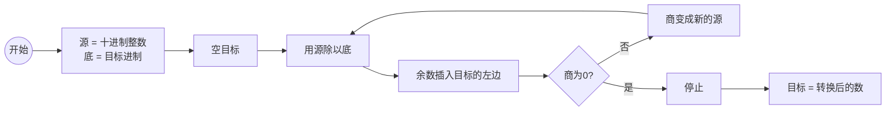
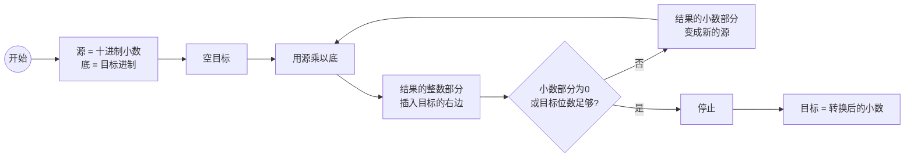
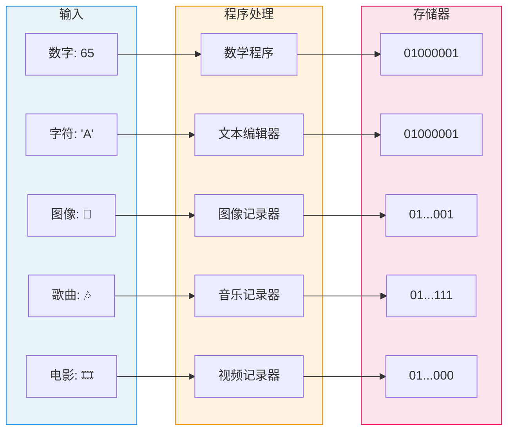

# 计算机基础

## 计算机模型

首个计算机模型是 1936 年由阿兰图灵提出，称为 **图灵模型**：现代计算机的首次描述，只要提供适合的**程序**，该机器就能做任何运算。只要提供**输入数据**和**程序**，机器在程序的控制下完成计算并**输出计算结果**

> [!NOTE]
>
> 图灵模型的**核心要点**：**程序概念的引入**；以及 **输出结果依赖于输入数据和程序**
>
> + **相同的程序＋不同的输入数据 ➡ 不同的输出结果**
>
>   
>
> + **相同的输入数据＋不同的程序 ➡ 不同的输出结果**
>
>   
>
> + 相同的输入数据＋相同的程序 ➡ 相同的输出结果

基于通用图灵机建造的计算机都是在存储器中存储数据。冯诺·依曼认为**程序和数据逻辑上是相同的**，因此程序也能存储在计算机存储器中。冯诺·依曼模型将计算机分为 $4$ 个子系统：存储器、算术逻辑单元、控制单元、输入输出子系统

> [!NOTE]
>
> 冯诺·依曼模型的**核心要点**：**存储程序** 和 **指令顺序执行**
>
> + **存储程序**：程序必须存储在存储器中；这意味着程序和数据具有相同的逻辑结构。现代计算机将数据和程序以 **位模式**（即，$0$ 和 $1$ 组成的序列）的形式存储在存储器
> + **指令顺序执行**：程序由一组数量有限的指令组成。控制单元从存储器中按照顺序依次读取一条指令，解释并执行

## 数字系统

数字系统定义了如何用特定的符号来表示一个数字；由于符号数量有限，表示一个数字时需要重复使用它们。目前，常用的数字系统有两类：**位置化数字系统** 和 **非位置化数字系统**；我们主要学习的是位置化数字系统

> [!NOTE]
>
> 位置化数字系统的核心要点：数字符号的位置决定了其表示的值。在位置化数字系统中，**基数** $b$ 表示基本数符的个数，位置 $i$ 上的数字符号表示的值是 $S_i \times b^{i}$；也就是说，$(S_{k-1}S_{k-2}\cdots S_{1}S_{0} \cdot S_{-1}S_{-2} \cdots S_{-L})_{b}$ 表示的值时
>
> $$
> \text{value}=\pm\sum_{i=-L}^{K-1}S_{i}\times b^{i}
> $$

### 十进制系统

十进制系统使用 $10$ 个基本数符 $\{ 0, 1, 2, 3, 4, 5, 6, 7, 8, 9 \}$ 表示数字；这些数符称为 **十进制数码**（或数码）。十进制系统是我们日常生活中使用的数字系统，**如果数字表示不加任何说明，则默认是十进制系统**。例如，十进制数字系统中 $+224$ 表示的值是

$$
N=+ 2\times10^2+2\times10^1+4\times10^0
$$

### 二进制系统

二进制系统仅使用 $2$ 个基本数符 $\{0, 1\}$ 表示数字；这些数符称为 **二进制数码** 或 **位**。下一个小结我们会介绍如何使用**二进制位模式**（位串）将数据和程序存储在计算机中

> [!NOTE]
>
> 现代计算机由电子开关制成。它们仅有**开**和**关**两种状态，正好与二进制系统对应；位 $1$ 表示其中一种状态，位 $0$ 就表示另一种状态

例如，二进制数 $(11001)_2$ 表示的值是

$$
N = 1 \times 2^4 + 1 \times 2^3 + 0 \times 2^2 + 0 \times 2^1 + 1 \times 2^0 = 25
$$

例如，二进制数 $(101.11)_2$ 表示的值是

$$
N = 1 \times 2^2 + 0 \times 2^1 + 1 \times 2^0 + 1\times 2^{-1} + 1 \times 2^{-2} = 5.75
$$

### 十六进制系统

十六进制系统使用 $16$ 个符号 $\{0, 1, 2, 3, 4, 5, 7, 8, 9\}$ 和 $\{A, B, C, D, E, F\}$ 来表示数字，其中 $\{A, B, C, D, E, F\}$ 分别表示 $\{10, 11, 12, 13, 14, 15\}$；这些数符称为**十六进制数码**

例如，十六进制数 $(2AE)_{16}$ 表示的值是

$$
N = 2\times 16^2 + 10 \times 16^1 + 14 \times 16^0 = 686
$$

> [!TIP]
>
> 二进制系统方便了计算机，但是确为人类阅读数字带来了困难。与十进制系统相比，表示同一个数字时，二进制系统需要使用更多符号。然而，十进制与二进制没有明显的直接关联，无法直接显示存储在计算机中的是什么
>
> 十六进制系统和二进制系统有明显的关联关系；可以直接从十六进制系统观察到二进制系统

### 八进制系统

八进制系统使用 $8$ 个基本数符 $\{ 0, 1, 2, 3, 4, 5, 6, 7\}$ 表示数字；这些数符称为 **八进制数码**。例如，八进制数 $(1256)_{8}$ 表示的值是

$$
N = 1 \times 8^3 + 2 \times 8 ^ 2 + 5 \times 8^1 + 6 \times 8^{0} = 686
$$

> [!TIP]
>
> 八进制系统与二进制系统也存在明显的关联关系，但是八进制系统目前使用较少。

### 进制转换

**其他进制向十进制转换**是非常明显的：将数码与其位置量相乘并相加即可（位置系统的定义）。稍微复杂的是将**十进制数转化为其他进制**；需要分两步完成：**整数部分转换** 和 **小数部分的转换**。下图描述了将**十进制整数转换为其他进制**的流程图：**除以目标基数取余数插入目标最左端**

例如，将 $35$ 转化为二进制数：从 $35$ 开始，除以 $2$ 得到商和余数；余数放在目标的最左端，商成为新的源；直到商变为 $0$ 为止

下图描述了将**十进制小数转换为其他进制**的流程图：**乘以目标基数取整数部分插入目标最右端**

例如，将 $0.634$ 转换为八进制数且精确到 $4$ 位小数：从 $0.634$ 开始，乘以 $8$ 的到一个结果；整数部分放在目标的最右端，小数部分称为新的源；直到小数部分为零或者满足精度要求

---

在介绍二进制与十六进制和八进制之间的转换之前，我们先看以下**进制基数对照表**

| 十进制 | 八进制     | 二进制       | 十六进制   |
| ------ | ---------- | ------------ | ---------- |
| $0$    | $(0)_{8}$  | $(0000)_{2}$ | $(0)_{16}$ |
| $1$    | $(1)_{8}$  | $(0001)_{2}$ | $(1)_{16}$ |
| $2$    | $(2)_{8}$  | $(0010)_{2}$ | $(2)_{16}$ |
| $3$    | $(3)_{8}$  | $(0011)_{2}$ | $(3)_{16}$ |
| $4$    | $(4)_{8}$  | $(0100)_{2}$ | $(4)_{16}$ |
| $5$    | $(5)_{8}$  | $(0101)_{2}$ | $(5)_{16}$ |
| $6$    | $(6)_{8}$  | $(0110)_{2}$ | $(6)_{16}$ |
| $7$    | $(7)_{8}$  | $(0111)_{2}$ | $(7)_{16}$ |
| $8$    | $(10)_{8}$ | $(1000)_{2}$ | $(8)_{16}$ |
| $9$    | $(11)_{8}$ | $(1001)_{2}$ | $(9)_{16}$ |
| $10$   | $(12)_{8}$ | $(1010)_{2}$ | $(A)_{16}$ |
| $11$   | $(13)_{8}$ | $(1011)_{2}$ | $(B)_{16}$ |
| $12$   | $(14)_{8}$ | $(1100)_{2}$ | $(C)_{16}$ |
| $13$   | $(15)_{8}$ | $(1101)_{2}$ | $(D)_{16}$ |
| $14$   | $(16)_{8}$ | $(1110)_{2}$ | $(E)_{16}$ |
| $15$   | $(17)_{8}$ | $(1111)_{2}$ | $(F)_{16}$ |

> [!NOTE]
>
> 从进制基数对照表中，我们可以得到下面两条结论
>
> + **二进制中的 $3$ 位恰好是八进制中的 $1$ 位**
> + **二进制中的 $4$ 位恰好是十六进制中的 $1$ 位**
>
> 利用上述两条规则 **十六进制↔二进制↔八进制** 之间的相互转换会非常便捷和简单

例如，下图展示了将二进制数 $(10011100010)_{2}$ 转换位十六进制和八进制数

## 数据的表示

计算机是处理数据的机器，冯诺·依曼结构的计算机将程序和数据都存储在存储器中。现实世界，数据以不同的形式出现，例如**数字**、**文本**、**图片**和视频等；然而，存储器只能存储由 $0$ 和 $1$ 组成的**位模式**。程序为位模式附加一个**数据类型**，这样可以以相同的位模式将不同类型的数据存储在内存中

任何数据在存储到计算机内存之前，会被表示成二进制系统中数字；对于不同类型的数据需要解决的问题不同。下面我们开始学习每种类型的数据需要解决什么问题以及如何解决的

### 表示数字

数字存储到计算机内存，就需要解决两个问题

+ **如何表示数字的符号？**

+ **如何表示数字的小数点？**

小数点的存储有两种方式：**定点表示** 和 **浮点表示**；这两种方式表示的小数点都不会占用位，换句话说，**小数点是假定的**。定点表示通常用于整数，假定小数点在位模式的最右端；浮点数表示通常用于表示实数，也可能用于表示大整数，浮点表示不假设小数点的位置，隐含在位模式的分段上。下面我们首先来看**整数的二进制表示**吧

> 我们会在整数的二进制表示中介绍处理符号的方式三种：**无符号整数**、**符号+幅值** 和 **补码编码**

#### 无符号整数编码

对于长度为 $n$ 的位模式 $\vec x = [x_{n-1},x_{n-2},\cdots,x_{1},x_{0}]$，将它映射为非负整数的数学公式为
$$
B2U_{n}(\vec x) = \sum_{i=0}^{w-1}x_{i}\times 2^i
$$
这里 $x_{i} \in \{0, 1\}$。显然，长度为 $n$ 的位模式能够表示的最大无符号整数是 $U_{max} = 2^{n}-1$。

> [!NOTE]
>
> 无符号整数的加法：假设 $0\le x, y \lt 2^{n}$
>
> $$
> x +_{u} y = \begin{cases}
> x + y & x + y \lt 2^n & 正常\\
> x + y - 2^n & 2^n \le x + y \lt 2^{n+1} & 溢出
> \end{cases}
> $$

#### 补码编码

对于许多应用，我们还希望表示**负数值**。最常见的有符号数的计算机表示方式就是**补码**。在补码编码中，最高有效位（Most Significant Bit，MSB）解释为**负权**，其权重是 $-2^{w-1}$；最高有效位也成为 **符号位**

对于长度为 $n$ 的位模式  $\vec x = [x_{n-1},x_{n-2},\cdots,x_{1},x_{0}]$，将它映射为非负整数的数学公式为

$$
B2T_{n}(\vec x) = -x_{n-1}2^{w-1} + \sum_{i=0}^{n-2}x_i 2^i
$$

符号取决于符号位的值

+ $1$ 表示值为负数
+ $0$ 表示值为非负数

长度为 $n$ 的位模式，在补码编码下能表示的最小值是 $T_{min} = -2^{n-1}$（最高位为 $1$，其余全为 $0$），最大值 $T_{max} = 2^{n-1} - 1$（最高位为 $0$，其余为全为 $1$）

> [!NOTE]
>
> 补码加法：假设 $-2^{n-1}\le x, y \lt 2^{n-1}-1$
>
> $$
> x +_{t} y = \begin{cases}
> x + y - 2^{n} & 2^{n-1} \le x + y & 正溢出 \\
> x + y & -2^{n-1} \le x + y \lt 2^{n-1} & 正常\\
> x + y + 2^w & x + y \lt -2^{n-1} & 负溢出
> \end{cases}
> $$
>
> + 正溢出：两个正整数相加，结果为非正数
> + 负溢出：两个负整数相加，结果为非负数

现在，我们知道了位模式是如何映射成有符号整数；但是，没有解释背后的数学原理。现在，我们补充这个映射关系背后的理论。

> [!NOTE]
>
> 补码被设计出来就是为了将减法转化为加法运算的：$a - b = a + (-b)$；涉及的数学原理就是 **模算数**。存在有限非负整数域 $M = \{x \vert 0 \le x \lt m, x \in N \}$
>
> + 对于 $a,b \in M$，则 $a + b = (a + b)\bmod {m}$
> + 对于 $a,b \in M$，$a + b = m$，则 $a + b = m \bmod{m} = 0$
>
> 也就是说，在非负整数域 $M$ 中，如果 $a + b = m$，则 $b = (m \bmod {m}) - a$；也就是说，$b$ 可以用来表示 $-a$。因此，$x - a = (x + b)\bmod {m}$

对于 $n$ 位 $r$ 进制数，如果 $a + b = r^{n}$，则称 $a$ 和 $b$ 互为**基数的补数**（$r$ 的补数）；如果 $a + b = r^{n} - 1$，则称 $a$ 和 $b$ 互为**减基数的补数**（$r-1$的补数，简称 **减补数**）。

对于 $n$ 位 $r$ 进制数 $a$，其位置表示形式为

$$
a = \sum_{i=0}^{n-1}a_{i}\times r^{i}
$$

再根据基数的补数定义，我们有

$$
\begin{aligned}
a + b &= r^{n}\\
b &= r^{n} - a\\
&= \left(\sum_{i=0}^{n-1}(r-1)r^{i} + 1\right) - \sum_{i=0}^{n-1}a_{i}r^{i}\\
&=\sum_{i=0}^{n-1}(r-1-a_i)r^{i} + 1
\end{aligned}
$$

> [!NOTE]
>
> 对于 $n$ 位 $r$ 进制数 $a$ 的补数 $b$
>
> $$
> b =\sum_{i=0}^{n-1}(r-1-a_i)r^{i} + 1
> $$
>
> 根据这个公式，**计算 $n$ 位 $r$ 进制数 $a$ 的补数的方法就是使用 $r-1$ 减去数 $a$ 的每一位，然后再加上 $1$**

#### 符号+幅值编码

有符号整数的另一种编码方式是使用**符号+幅值**进行编码：在这个编码方式中，MSB 作为符号位，用来确定剩余位应该取父权还是正权。即

$$
B2S_{n}(\vec x) = (-1)x_{n-1}\times \left( \sum_{i=0}^{n-2}x_i 2^{i} \right)
$$

> [!NOTE]
>
> 符号+幅值编码也称为 **原码编码**；但是，它有一个奇怪的属性，对于数字 $0$ 存在两种不同的编码方式：$+0$ 和 $-0$。幸运的是，我们现在不使用原码编码，了解它即可

#### 浮点数编码

定点表示法能够表示的数字范围有限。极大数和极小数用定点表示法可能完全无法接受。浮点表示法允许小数点浮动，该表示法基于科学计数法设计

$$
\text{value} = (-1)^{s} \times M \times b^{E}
$$

其中，$s$ 称为符号，$M$ 称为尾数，$E$ 称为阶段

+ 符号 $s$ 决定了这个数是负数（$s=1$）还是正数（$s=0$）
+ 尾数 $M$ 决定了这个数的精度
+ 阶码 $E$ 对浮点数加权，权重是 $b^E$（可能是负数）

浮点数编码就是将浮点数的位表示划分为三个字段，分别对上述值进行编码

+ 符号 $s$ 只需要 $1$ 位即可表示：$1$ 表示负数，$0$ 表示正数
+ 阶码 $E$ 使用 $k$ 位位模式编码
+ 尾数 $M$ 使用 $n$ 位位模式编码

目前浮点数编码最常用的标准的就是 IEEE 754 binary 标准，该标准分为 binary32（单精度浮点数）binary64（双精度浮点数）以及 binary128（四进度浮点数）；这里我们主要介绍 binary32 和 binary64 两种浮点格式，下图描述了三个字段在位模式的位置和占用的位数

IEEE 754 bianry 浮点数格式，根据 `exp` 的值，被编码的值可以分成三种不同的情况

**情形1**：这是最普遍的情形。当 `exp` 字段的位模式**不全为 $0$，也不全为 $1$** 时，都表示**规格化数**。

+ **阶码字段**被解释为 **偏置（biased）表示的有符号整数**：阶码 $E = e - Bias$，其中 $e$ 是阶段字段的无符号数，偏置值 $Bias = 2^{k-1} - 1$（$k$ 是阶码字段的位数）
+ **尾数字段**被解释为为描述小数值 $f$，其中 $0 \le f \lt 1$，其二进制表示为 $0.f_{n-1}\cdots f_{1}f_{0}$，也就是二进制小数点在最高有效位的左边。尾数 $M = 1 + f$（**隐含的以 $1$ 开头**表示）

**情形2**：当 `exp` 字段的位模式全是 $0$ 时，所表示的数时 **非规格化数**

+ **阶码字段**表示的值是 $E=1-Bias$
+ **尾数字段**表示的值是 $M=f$（不隐含开头的 $1$）

> [!NOTE]
>
> 非规格化数的用途
>
> + 表示数值 $0$：因为规格化数要求尾数 $M \ge 1$，因此不能使用规格化数表示 $0$
> + 表示非常接近 $0.0$ 的数：提供一种**逐渐溢出**的属性，可能的数值分布均匀地接近 $0.0$

**情形3**：当 `exp` 字段的位模式全是 $1$ 时，表示这是一个 **特殊值**

+ **阶段字段**表示的值是 $E = (2^{k} - 1) - (2^{k-1} - 1) = 2^{k-1}$
+ **尾数字段**表示的值是 $0$ 时，该值表示**无穷大**
+ **尾数字段**表示的值是非 $0$ 时，该值表示**NaN（Not a Number）**

### 表示文本

**文本** 表示某种含义的一系列符号（字符）。组成文本的基本单位是 **字符**；例如，在英文中，使用 $26$ 个符号 $A,B,C\cdots, Z$ 来表示大写字母，$26$ 个符号 $a,b,c,\cdots,z$ 来表示小写字母，$10$ 个符号 $0,1,\cdots,9$ 来表示数字字符，以及符号 $.?,;:\dots!$ 等来表示标点符号。此外，还有一些非打印字符，例如，换行符、制表符等。

我们可以使用位模式来表示任意一个符号。问题是位模式的长度 $n$ 该如何确定呢？这主要取决于基本符号的个数。例如，如果我们只需要表示 $26$ 个字符，位模式长度至少能够表示 $26$ 个不同的位模式

> [!NOTE]
>
> 表示字符的位模式长度取决于符号的数量，但是它们并不是线性关系，而是对数关系。例如，如果只需要表示 $2$ 个符号，位模式的长度为 $1$ 即可，即 $log_2{2} = 1$；如果需要表示 $4$ 个符号，位模式的长度为 $log_{2}4 = 2$。也就是说，符号数量 $N$ 与位模式长度 $n$ 的关系为
>
> $$
> n = \log_{2} N
> $$

#### ASCII

美国国家标准学会（American National Standards Institute，ANSI）开发了一个被称为美国信息交换标准码（ASCII）的代码。该代码使用 $7$ 位表示每个符号，即该代码可以定义 $2^7 = 128$ 种不同的符号

#### Unicode 与 UCS

ASCII 字符集只适合使用英文的国家，对于非英文国家，ASCII 字符集不适用。为了克服这一困难，ISO 10646 标准定义了 **通用字符集**（Universal Character Set）简称 **UCS**。它与 ASCII 字符一样，定义了字符和整数代码（也称代码点）之间的映射关系。

UCS 使用 $32$ 位长度的位模式定义字符集，提供了 $2^{32}$ 个不同的字符

> [!NOTE]
>
> 代码点与编码是两种不同的概念
>
> + 代码点：是整数，会被映射为一个字符
> + 编码：给定代码点的字节序列

Unicode 是由 Unicode 联盟定义的字符编码标准，它不仅定义了与 UCS 相同的代码点，还定义了这些代码点的几个不同的编码标准

+ UTF-8：将代码点映射到 $1 \sim 4$ 个字节中
+ UTF-16：将代码点映射到 $1$ 或 $2$ 个 $16$ 位值
+ UTF-32：将代码点映射到 $32$ 位值

这三种编码方式中，UTF-8 是最常用的编码方式。下表给出了UTF-8的编码规则

| Unicode 十六进制码点范围 | UTF-8 二进制                             |
| ------------------------ | ---------------------------------------- |
| 0000 0000 - 0000 007F    | **0**xxxxxxx                             |
| 0000 0080 - 0000 07FF    | **110**xxxxx 10xxxxxx                    |
| 0000 0800 - 0000 FFFF    | **1110**xxxx 10xxxxxx 10xxxxxx           |
| 0001 0000 - 0010 FFFF    | **11110**xxx 10xxxxxx 10xxxxxx 10xxxxxx  |
