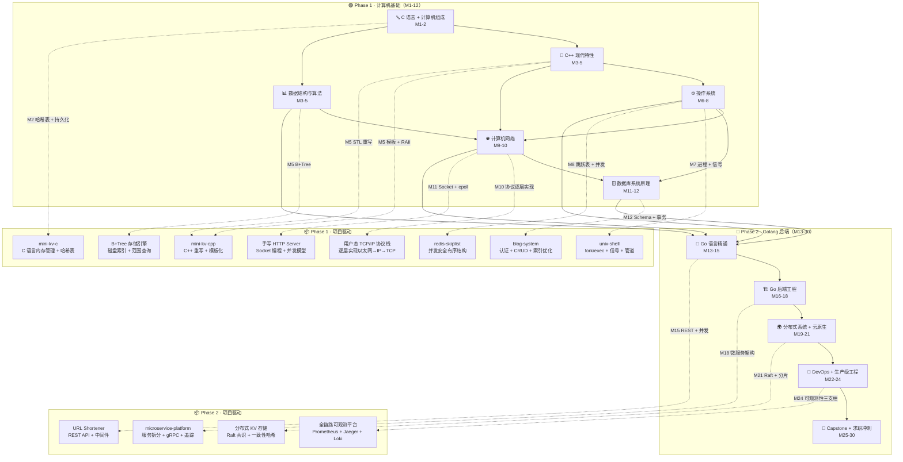

# 后端工程师：学习计划



仓库目录结构

```shell
backend/
├── README.md                 # 学习计划（2.5 年后端工程师路径）
├── .clangd                   # clangd 配置（C++23 标准 + 模块支持）
├── .gitignore                # Git 忽略规则
│
├── 01-notes/                 # 📝 学习笔记
│   ├── modern-c/                 #   C 语言笔记
│   ├── modern-cpp/               #   C++ 笔记
│   ├── data-structures/          #   数据结构与算法笔记
│   ├── computer-architecture/    #   计算机组成原理笔记
│   ├── operating-system/         #   操作系统笔记
│   ├── computer-networking/      #   计算机网络笔记
│   ├── database/                 #   数据库原理笔记
│   ├── golang/                   #   Go 语言笔记
│   ├── microservice/             #   微服务笔记
│   └── cloud-native/             #   云原生笔记
│
├── 02-practice/              # 💻 练习题与课堂实践
│   ├── modern-c/                 #   C 语言练习
│   ├── modern-cpp/               #   C++ 练习
│   ├── data-structures/          #   数据结构练习
│   ├── operating-system/         #   操作系统练习
│   ├── networking/               #   网络编程练习
│   ├── database/                 #   SQL 练习
│   └── golang/                   #   Go 语言练习
│
├── 03-projects/              # 🚀 综合项目
│   ├── mini-kv-c/                  #   mini-kv 存储引擎（C 版）
│   ├── mini-kv-cpp/                #   mini-kv 存储引擎（C++ 版）
│   ├── bplus-tree/                 #   B+Tree 存储引擎
│   ├── redis-skiplist/             #   Redis 跳跃表 + 字典实现
│   ├── unix-shell/                 #   极简 Unix Shell
│   ├── userspace-tcpip/            #   用户态 TCP/IP 协议栈
│   ├── blog-system/                #   博客系统全栈后端
│   ├── url-shortener/              #   URL 短链服务
│   ├── microservice-platform/      #   微服务平台
│   ├── distributed-kv/             #   分布式 KV 存储引擎（Raft）
│   └── observability-platform/     #   全链路可观测平台
│
├── 04-exercises/             # 📖 课后习题代码
│   └── leetcode/                 #   LeetCode 刷题记录
```
