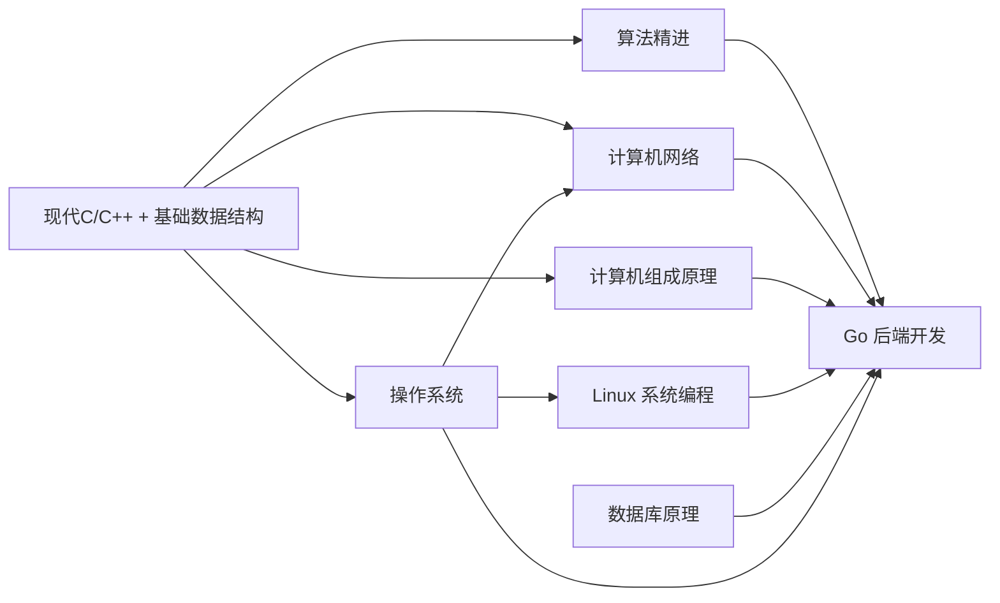

# 后端工程师：学习计划



仓库目录结构

```shell
backend/
├── README.md                 # 学习计划（2.5 年后端工程师路径）
├── .clangd                   # clangd 配置（C++23 标准 + 模块支持）
├── .gitignore                # Git 忽略规则
│
├── 01-notes/                 # 📝 学习笔记
│   ├── modern-c/             #   C 语言笔记
│   ├── modern-cpp/           #   C++ 笔记
│   ├── data-structures/      #   数据结构与算法笔记
│   ├── computer-architecture/#   计算机组成原理笔记
│   ├── operating-system/     #   操作系统笔记
│   ├── database/             #   数据库原理笔记
│   ├── golang/               #   Go 语言笔记
│   ├── microservice/         #   微服务笔记
│   └── cloud-native/         #   云原生笔记
│
├── 02-practice/              # 💻 练习题与课堂实践
│   ├── c-language/
│   ├── cpp/
│   ├── data-structures/
│   └── ...
│
├── 03-projects/              # 🚀 综合项目
│   ├── mini-kv-c/            #   mini-kv 存储引擎（C 版）
│   ├── mini-kv-cpp/          #   mini-kv 存储引擎（C++ 版）
│   ├── bplus-tree/           #   B+Tree 存储引擎
│   ├── redis-skiplist/       #   Redis 跳跃表 + 字典实现
│   ├── unix-shell/           #   极简 Unix Shell
│   ├── blog-system/          #   博客系统全栈后端
│   ├── microservice-platform/#   微服务平台
│   └── url-shortener/        #   URL 短链服务
│
├── 04-exercises/             # 📖 课后习题代码
│   └── leetcode/             #   LeetCode 刷题记录
```
