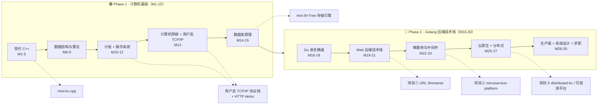

# 后端工程师：2.5 年学习计划

> 详细计划见 [CURRICULUM.md](CURRICULUM.md)，每周进度见 [PROGRESS.md](PROGRESS.md)。
> 时间预算：每周 10–20 小时；前 15 个月计算机基础（C++ / 数据结构与算法 / 操作系统 / 计算机组成原理 / 数据库原理），后 15 个月 Golang 后端技术栈。


```mermaid
graph LR
    subgraph P1["🟢 Phase 1 · 计算机基础（M1-15）"]
        M15["现代 C++<br/>M1-5"]
        M69["数据结构与算法<br/>M6-9"]
        M1012["计组 + 操作系统<br/>M10-12"]
        M13["计算机网络 + 用户态 TCP/IP<br/>M13"]
        M1415["数据库原理<br/>M14-15"]
        M15 --> M69 --> M1012 --> M13 --> M1415
    end

    subgraph P2["🔵 Phase 2 · Golang 后端技术栈（M16-30）"]
        G1["Go 语言精通<br/>M16-18"]
        G2["Web 后端技术栈<br/>M19-21"]
        G3["微服务与中间件<br/>M22-24"]
        G4["云原生 + 分布式<br/>M25-27"]
        G5["生产级 + 系统设计 + 求职<br/>M28-30"]
        G1 --> G2 --> G3 --> G4 --> G5
    end

    KV_CPP["mini-kv-cpp"]
    BTREE["mini B+Tree 存储引擎"]
    TCPIP["用户态 TCP/IP 协议栈<br/>+ HTTP demo"]
    PROJ1["项目① URL Shortener"]
    PROJ2["项目② microservice-platform"]
    PROJ3["项目③ distributed-kv / 可观测平台"]

    M1415 --> P2
    M15 -.-> KV_CPP
    M1012 -.-> TCPIP
    M13 -.-> TCPIP
    M1415 -.-> BTREE
    G2 -.-> PROJ1
    G3 -.-> PROJ2
    G4 -.-> PROJ3
```

+ **算法线全程不断**：M1 起每周 3–4 题（求职期 2–3 题保持），累计 300+ 题
+ **项目标准**：README 可复现、测试覆盖、性能数据、3 分钟讲解稿

仓库目录结构

```shell
backend/
├── README.md                 # 学习计划总览（详细计划见 CURRICULUM.md）
├── CURRICULUM.md             # 2.5 年完整课程大纲
├── PROGRESS.md               # 每周五更新的学习进度
├── AGENTS.md                 # AI 编程代理的仓库工作说明
├── .clangd                   # clangd 配置（C23 / C++23 标准）
├── .gitignore                # Git 忽略规则
│
├── 01-notes/                 # 📝 学习笔记
│   ├── modern-cpp/               #   C++ 笔记
│   ├── data-structures/          #   数据结构与算法笔记
│   ├── computer-architecture/    #   计算机组成原理笔记
│   ├── operating-system/         #   操作系统笔记
│   ├── computer-networking/      #   计算机网络笔记
│   ├── database/                 #   数据库原理笔记
│   ├── golang/                   #   Go 语言笔记
│   ├── microservice/             #   微服务笔记
│   └── cloud-native/             #   云原生笔记
│
├── 02-practice/              # 💻 练习题与课堂实践
│   ├── modern-cpp/               #   C++ 练习
│   ├── data-structures/          #   数据结构练习
│   ├── operating-system/         #   操作系统练习
│   ├── networking/               #   网络编程练习
│   ├── database/                 #   SQL 练习
│   └── golang/                   #   Go 语言练习
│
├── 03-projects/              # 🚀 综合项目（✅=计划内必做，⭕=可选实验）
│   ├── mini-kv-cpp/                #   ✅ M1-5：C++ 主线项目（RAII/模板/可插拔）
│   ├── bplus-tree/                 #   ✅ M14-15：B+Tree 存储引擎
│   ├── url-shortener/              #   ✅ 项目①（M19-21）
│   ├── microservice-platform/      #   ✅ 项目②（M22-24）
│   ├── distributed-kv/             #   ✅ 项目③ 选项 A（M25-27）
│   ├── observability-platform/     #   ⭕ 项目③ 选项 B（二选一）
│   ├── unix-shell/                 #   ⭕ M10-12 可选实验
│   ├── redis-skiplist/             #   ⭕ 可选实验
│   ├── userspace-tcpip/            #   ✅ M13 核心项目：用户态 TCP/IP 协议栈
│   └── blog-system/                #   ⭕ 可选（DB 原理课的 schema 载体）
│
├── 04-exercises/             # 📖 课后习题代码
│   └── leetcode/                 #   LeetCode 刷题记录
```
