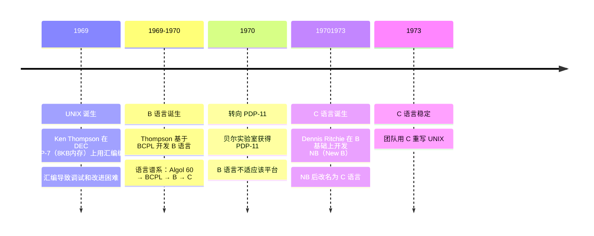
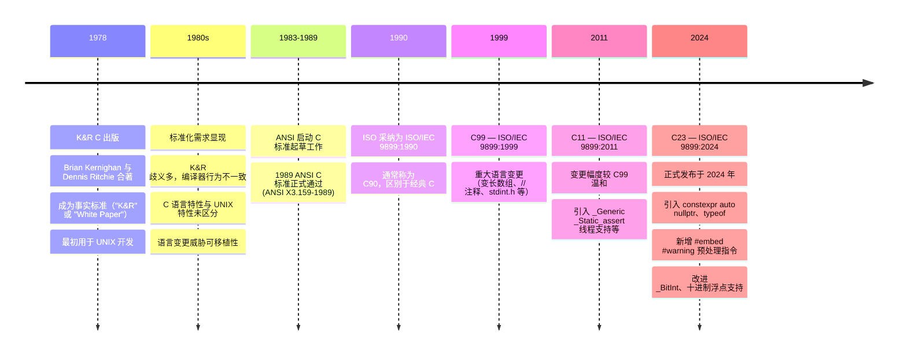

# Modern C

C 语言是 20 世纪 70 年代初期在贝尔实验室开发出来的一种编程语言。

## 起源

C 语言是 UNIX 系统从汇编转向高级语言的产物，其诞生直接源于 PDP-11 平台的限制，最终使 UNIX 具备 **可移植性**，成为现代操作系统的基础。

1969 年，由 Ken Thompson 在 DEC PDP-7（仅 8KB 内存）上用汇编语言独立编写 UNIX 操作系统。1969-1970 年间，由于汇编语言编写的程序难以调试和改进；Thompson 为解决这些问题，基于 BCPL 语言开发了 B 语言

Dennis Ritchie 也加入到了 UNIX 项目中，并且开始着手用 B 语言编写程序。1970 年贝尔实验室获得 PDP-11，B 语言也经过改进并能够在 PDP-11 计算机上成
功运行后，Thompson 用 B 语言重新编写了部分 UNIX 代码

1971 年，B 语言已经明显不适合 PDP-11了，Dennis Ritchie 在 B 基础上开发 NB（New B），后改名为C语言。1973 年 C 语言稳定，团队用 C 重写 UNIX。C 语言带来一非常重要的好处：**可移植性**

> [!TIP]
> 通过为不同机器编写 C 编译器，UNIX 可跨平台运行，摆脱硬件依赖。

下面是 C 语言起源的完整时间线

## 标准化

C语言从 K&R 非正式标准起步，因可移植性压力催生 ANSI/ISO 标准化，历经 C89、C99、C11 到 C18，逐步发展为成熟、稳定的系统编程语言。

1978年 Brian Kernighan 与 Dennis Ritchie 合著《C程序设计语言》，成为事实上的 C 语言标准，俗称 K&R。

当时 C 用户多为 UNIX 开发者，20 世纪 80 年代后随 IBM PC 等平台普及，C 语言迅速普及，从而导致一列的问题出现。由于为新平台编写 C 编译器的程序员都参考 K&R。但是，K&R 对一些语言特性的描述非常模糊，以至于不同的编译器常常会对这些特性做出不同的处理；并且，K&R 也没有对属于C 语言的特性和属于 UNIX 系统的特性进行明确的区分。C 语言本身也在不断的变化，缺少统一规范，从而威胁到了 C 程序的可移植性

1983 年 ANSI 启动 C 标准制订，1988 年完成，1989 年正式通过（ANSI X3.159-1989）。1990年 ISO 采纳为 ISO/IEC 9899:1990（即C89/C90，区别于经典C）。此后，C 语言标准统一由 ISO 进行修订。下面是 C 语言标准化的时间线

## 目录

现代 C 语言书籍 [Modern C](https://inria.hal.science/hal-02383654v2) 学习笔记

### Level 0 · Encounter

#### ch01 — [快速入门](ch01-getting-started.md) ☑ 已完成
- [x] 知识点 1：命令式编程
- [x] 知识点 2：编译型语言
- [x] 知识点 3：编译器是朋友

#### ch02 — [程序的基本结构](ch02-principal-structure.md) ☑ 已完成
- [x] 知识点 1：语法（Grammar）
- [x] 知识点 2：声明（Declarations）
- [x] 知识点 3：定义（Definitions）
- [x] 知识点 4：语句（Statements）

### Level 1 · Acquaintance

#### ch03 — [控制流](ch03-control-flow.md) ☑ 已完成
- [x] 知识点 1：条件执行（if）
- [x] 知识点 2：for 循环
- [x] 知识点 3：while 循环
- [x] 知识点 4：do-while 循环
- [x] 知识点 5：break 和 continue
- [x] 知识点 6：多路选择（switch）

#### ch04 — [表达计算](ch04-expressions.md) ☑ 已完成
- [x] 知识点 1：表达式
- [x] 知识点 2：算术运算
- [x] 知识点 3：无符号溢出与回绕
- [x] 知识点 4：修改对象的运算符
- [x] 知识点 5：比较运算符与布尔语境
- [x] 知识点 6：逻辑运算符与短路求值
- [x] 知识点 7：三元运算符与求值顺序

#### ch05 — 基本值与数据（Basic Values） ☐ 进行中
- [x] 知识点 1：抽象状态机
- [x] 知识点 2：基本类型
- [x] 知识点 3：语义类型
- [x] 知识点 4：窄类型与整数提升
- [x] 知识点 5：整数字面量
- [x] 知识点 6：浮点和复浮点字面量
- [x] 知识点 7：字符和字符串字面量
- [x] 知识点 8：隐式转换
- [x] 知识点 9：初始化器
- [x] 知识点 10：命名常量
- [x] 知识点 11：复合字面量
- [x] 知识点 12：无符号整数的二进制表示
- [x] 知识点 13：位运算符 — & | ^ ~
- [ ] 知识点 14：移位运算符 — << >>
- [ ] 知识点 15：有符号整数的表示
- [ ] 知识点 16：有符号整数溢出与未定义行为
- [ ] 知识点 17：定宽整数类型
- [ ] 知识点 18：精确定位宽整数 _BitInt（C23）
- [ ] 知识点 19：浮点数据的二进制表示

#### ch06 — 待定 ☐ 未开始
- [ ] 知识点 1：待定

#### ch07 — 待定 ☐ 未开始
- [ ] 知识点 1：待定
