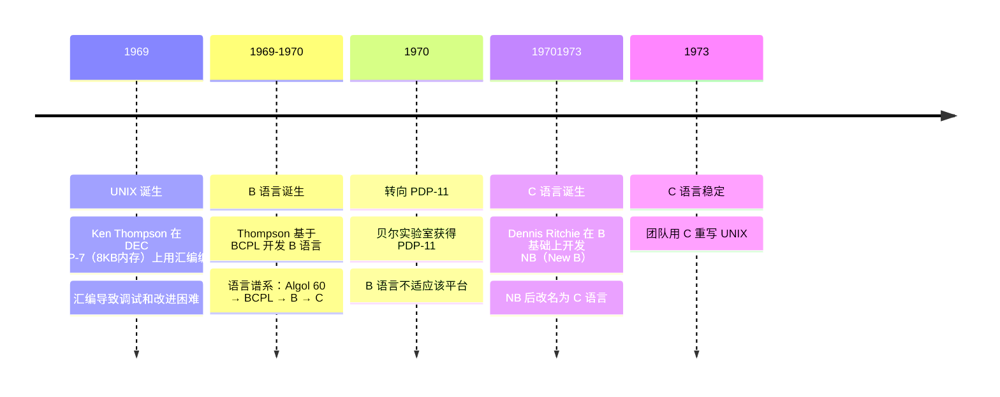
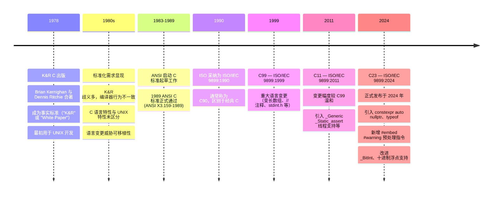

# Modern C

C 语言是 20 世纪 70 年代初期在贝尔实验室开发出来的一种编程语言。

## 起源

C 语言是 UNIX 系统从汇编转向高级语言的产物，其诞生直接源于 PDP-11 平台的限制，最终使 UNIX 具备 **可移植性**，成为现代操作系统的基础。

1969 年，由 Ken Thompson 在 DEC PDP-7（仅 8KB 内存）上用汇编语言独立编写 UNIX 操作系统。1969-1970 年间，由于汇编语言编写的程序难以调试和改进；Thompson 为解决这些问题，基于 BCPL 语言开发了 B 语言

Dennis Ritchie 也加入到了 UNIX 项目中，并且开始着手用 B 语言编写程序。1970 年贝尔实验室获得 PDP-11，B 语言也经过改进并能够在 PDP-11 计算机上成
功运行后，Thompson 用 B 语言重新编写了部分 UNIX 代码

1971 年，B 语言已经明显不适合 PDP-11了，Dennis Ritchie 在 B 基础上开发 NB（New B），后改名为C语言。1973 年 C 语言稳定，团队用 C 重写 UNIX。C 语言带来一非常重要的好处：**可移植性**

> [!TIP]
> 通过为不同机器编写 C 编译器，UNIX 可跨平台运行，摆脱硬件依赖。

下面是 C 语言起源的完整时间线

## 标准化

C语言从 K&R 非正式标准起步，因可移植性压力催生 ANSI/ISO 标准化，历经 C89、C99、C11 到 C18，逐步发展为成熟、稳定的系统编程语言。

1978年 Brian Kernighan 与 Dennis Ritchie 合著《C程序设计语言》，成为事实上的 C 语言标准，俗称 K&R。

当时 C 用户多为 UNIX 开发者，20 世纪 80 年代后随 IBM PC 等平台普及，C 语言迅速普及，从而导致一列的问题出现。由于为新平台编写 C 编译器的程序员都参考 K&R。但是，K&R 对一些语言特性的描述非常模糊，以至于不同的编译器常常会对这些特性做出不同的处理；并且，K&R 也没有对属于C 语言的特性和属于 UNIX 系统的特性进行明确的区分。C 语言本身也在不断的变化，缺少统一规范，从而威胁到了 C 程序的可移植性

1983 年 ANSI 启动 C 标准制订，1988 年完成，1989 年正式通过（ANSI X3.159-1989）。1990年 ISO 采纳为 ISO/IEC 9899:1990（即C89/C90，区别于经典C）。此后，C 语言标准统一由 ISO 进行修订。下面是 C 语言标准化的时间线

## 目录

> 笔记按周计划组织，每周融合对应教材章节，不按教材线性走。

### week01 — [C 语言基础](week01/index.md) ☑ 已完成

| # | 知识点 | 状态 |
|---|--------|------|
| 21 | 抽象状态机 | ☑ 已完成 |
| 22 | 基本类型 | ☑ 已完成 |
| 23 | 语义类型 | ☑ 已完成 |
| 24 | 窄类型与整数提升 | ☑ 已完成 |
| 25 | 整数字面量 | ☑ 已完成 |
| 26 | 浮点和复浮点字面量 | ☑ 已完成 |
| 27 | 字符和字符串字面量 | ☑ 已完成 |
| 28 | 隐式转换 | ☑ 已完成 |
| 29 | 初始化器 | ☑ 已完成 |
| 30 | 命名常量 | ☑ 已完成 |
| 31 | 复合字面量 | ☑ 已完成 |
| 32 | 无符号整数的二进制表示 | ☑ 已完成 |
| 33 | 位运算符 | ☑ 已完成 |
| 34 | 移位运算符 | ☑ 已完成 |
| 35 | 有符号整数的表示 | ☑ 已完成 |
| 36 | 定宽整数类型 | ☑ 已完成 |
| 37 | 精确定位宽整数 | ☑ 已完成 |
| 38 | 浮点数的二进制表示 | ☑ 已完成 |

### week02 — 函数、数组与字符串 ☐ 进行中

| # | 知识点 | 状态 |
|---|--------|------|
| 39 | 数组基础 | ☑ 已完成 |
| 40 | 多维数组 | ☑ 已完成 |
| 41 | 字符串基础 | ☑ 已完成 |
| 42 | 字符串函数 | ☑ 已完成 |
| 43 | 数组与指针 | ☑ 已完成 |
| 44 | 函数基础 | ☐ 进行中 |
| 45 | 作用域与生命周期 | ☐ |
| 46 | 递归 | ☐ |
| 47 | 函数指针 | ☐ |
| 48 | main 函数 | ☐ |
| 49 | stdio.h 输入输出 | ☐ |
| 50 | string.h 字符串函数 | ☐ |
| 51 | math.h 数学函数 | ☐ |
| 52 | stdlib.h 工具函数 | ☐ |

### week03 — 指针（上）☐ 未开始

### week04 — 指针（下）☐ 未开始

### week05 — 动态内存管理 ☐ 未开始

### week06 — 结构体、联合体与位操作 ☐ 未开始

### week07-09 — 数据结构实践 ☐ 未开始

### week10 — I/O 与文件系统 ☐ 未开始

### week11 — 编译与构建 ☐ 未开始

### week12 — mini-kv 项目 ☐ 未开始

