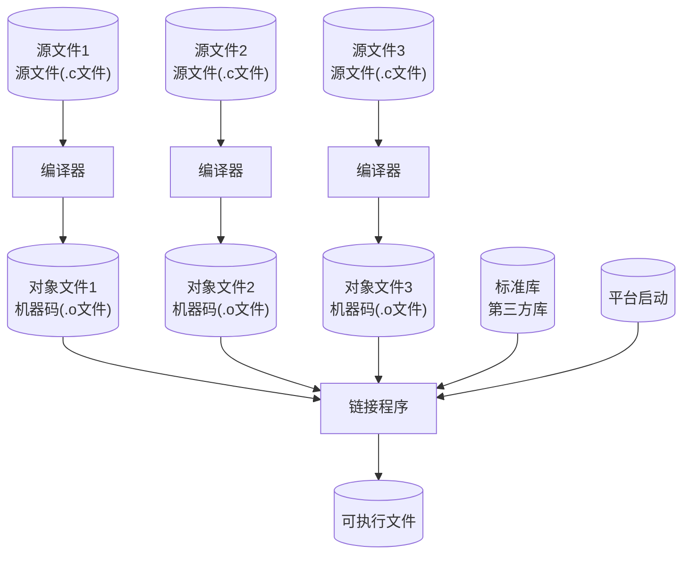

# Modern C 笔记：ch01-快速入门

> 章节：第 1 章 · Getting Started（快速入门）  
> 日期：2026-07-24  
> 状态：☑ 已完成

---

## 📋 速览

C 语言是命令式、编译型语言。程序从 `main` 函数开始，通过 `printf` 输出。源码必须经编译器翻译为机器码才能运行。编译时加 `-Wall` 启用警告，零警告才算干净程序。编译器是朋友——每个警告背后都可能是一个 `bug`。

---

## 📖 知识点

### 知识点 1：命令式编程 ☑ 已完成

**是什么**

C 是命令式编程语言——程序员向计算机下达指令，计算机按顺序逐条执行。

**详细解释**

"命令式"（imperative）源于祈使句——"走过去""拿起来""放下"。C 程序也一样：声明变量、执行计算、输出结果。每一步是一条明确的命令，顺序执行。

**第一个代码示例**：这是 Modern C 第一章的完整示例程序 `getting-started.c`。看懂它，就入了 C 的门。

```c
/* This may look like nonsense, but really is -*- mode: C -*- */
#include <stdlib.h>
#include <stdio.h>

/* The main thing that this program does. */
int main(int argc, [[maybe_unused]]char* argv[argc + 1]) {
    // ⬇ 这是声明语句：A[5] 表示长度为 5 的数组，前面的 double 表示数组元素的类型
    double A[5] = {
        [0] = 9.0,    // ⬅ [0] = 9.0 C99 引入的 **指定初始化**
        [1] = 2.9,
        [4] = 3.E+25,
        [3] = .00007,
        //[2] = 0.0,// ⬅ [2] 号元素没有在初始化列表中，编译器默认初始化为0.0
    };

    for (size_t i = 0; i < 5; ++i) {
        printf("element %zu is %g, \tits square is %g\n", // ⬅ 第一个参数
               i, 					// ⬅ 替换 %zu
               A[i], 				// ⬅ 替换第一个 %g
               A[i]*A[i]);			// ⬅ 替换第二个 %g
    }

    return EXIT_SUCCESS; 			// ⬅ main 函数返回值
}
```

**逐行理解：** 在 C 程序中，真正执行动作是 **语句**（其他语言可能称为 **指令**）

| 行 | 是什么 | 做什么 |
|----|--------|--------|
| `#include <...>` | 预处理指令 | 引入 `printf `和 `EXIT_SUCCESS `的声明 |
| `int main(...)` | 程序入口 | 操作系统从这里开始执行，返回 `int` |
| `double A[5] = {...}` | 数组声明 | $5$ 个 `double` 类型的元素，用指定索引初始化 |
| `for (size_t i=0;...)` | 循环 | `i` 从 $0$ 到 $4$，每次执行循环体 |
| `printf(...)` | 格式化输出 | 调用名为 `printf` 的函数 |
| `return EXIT_SUCCESS` | 返回状态 | 程序结束退出，告诉操作系统"正常结束" |

**运行结果**

```shell
➜ ./getting-started
element 0 is 9,         its square is 81
element 1 is 2.9,       its square is 8.41
element 2 is 0,         its square is 0
element 3 is 7e-05,     its square is 4.9e-09
element 4 is 3e+25,     its square is 9e+50
```

显然，程序输出的文本是 `printf` 函数进行输出的，它接收 $4$ 个参数，放在圆括号 `(....)` 中：

1. **字符串字面两**（引号内的文本）— 作为输出的 **格式**。包含三个**格式说明符**（以 `%`开头）：一`%zu` 和两个`%g`，标记了数字插入的位置。还有一些**转义字符**（以`\`开头）：`\t`（横向制表符）和 `\n`（换行）
2. 变量`i` — 其值将替换第一个格式说明符 `%zu`
3. `A[i]` — 替换第二个格式说明符（第一个  `%g` ）
4. `A[i] * A[i]` — 替换最后一个  `%g` 。

---

### 知识点 2：编译型语言 ☑ 已完成

**是什么**：

C 源码不能直接运行，必须先用**编译器**翻译成**机器码**(二进制代码或可执行程序)。编译器取决于程序运行的**平台**：目标二进制代码是**平台相关的**—其形式和细节取决于目标计算机。编译器为各种不同的机器特定语言（**汇编语言**）提供了一层抽象

**可移植**：无论在哪个平台运行，程序的行为应该相同

正确的 C 程序可以在不同平台之间移植。所谓的正确的就是旨符合 C 标准、保证可移植性的 C 程序

**编译的四个阶段**

日常我们使用一条命令完成 C 源码的编译和链接：

```bash
➜ gcc -std=c23 -Wall  -Werror -o getting-started getting-started.c
```

下图演示了整个 GCC 编译器完整的编译流程



编译器编译 C 源码分为**四阶段**：预处理（.c → .i）→ 编译（.i → .s）→ 汇编（.s → .o）→ 链接（.o + lib + start → 可执行文件）。

```shell
# 分步查看
➜ gcc -std=c23 -Wall  -Werror -E getting-started.c -o getting-started.i   # 预处理
➜ gcc -std=c23 -Wall  -Werror -S getting-started.c -o getting-started.s   # 汇编代码
➜ gcc -std=c23 -Wall  -Werror -c getting-started.c -o getting-started.o   # 目标文件
➜ gcc -std=c23 -Wall  -Werror getting-started.o -o getting-started         # 链接
```

| 编译阶段   | 描述                                                        | 编译选项 |
| ---------- | ----------------------------------------------------------- | -------- |
| 预处理阶段 | 展开 `#include` → 替换宏 → 条件编译 → `*.i`(C代码)          | `-E`     |
| 编译阶段   | 语法分析 → 语义分析 → 生成汇编指令 → 优化 → `*.s`(汇编代码) | `-S`     |
| 汇编阶段   | 汇编指令 → 目标代码 → `*.o`(二进制代码)                     | `-c`     |
| 链接阶段   | 目标代码 + lib + start → 可执行文件                         |          |

**练习**

- [x] 用 -E、-S、-c 分步编译，查看中间文件

- [x] 用 file 命令对比 .o 和可执行文件的类型


    ```shell
    ➜ file getting-started.o
    getting-started.o: ELF 64-bit LSB relocatable, x86-64, version 1 (SYSV), not stripped
    ➜ file getting-started
    getting-started: ELF 64-bit LSB pie executable, x86-64, version 1 (SYSV), dynamically linked, interpreter /lib64/ld-linux-x86-64.so.2, BuildID[sha1]=fe0daa617c1a138a215adb10709efe71ebe83d6d, for GNU/Linux 4.4.0, not stripped
    ```
    
    + `.o` 文件是可重定位的；`可执行文件`是以进行链接后的文件

---

### 知识点 3：编译器是朋友 ☑ 已完成

**是什么**

编译器的警告不是找茬，是帮你定位 bug。**C 程序应该零警告编译通过**。

**详细解释**

Modern C 给出了一个有 bug 的版本（`bad.c`）

```c
/* This may look like nonsense, but really is -*- mode: C -*- */

/* The main thing that this program does. */
void main() {              // ← 错误：main 应该返回 int
  int i;
  double A[5] = {
      9.0,
      2.9,
      3.E+25,
      .00007,
  };

  for (i = 0; i < 5; ++i) {
     printf("element %d is %g, \tits square is %g\n",  // ← 缺少 #include <stdio.h>
            i,
            A[i],
            A[i]*A[i]);
  }

  return 0;               // ← void 函数不应该 return 值
}
```

和正确版本对比：

| 问题 | 错误写法 | 编译器反应 |
|------|---------|-----------|
| `main` 返回类型 | `void main()` | `error: return type of 'main' is not 'int'` |
| 缺少头文件 | 没有 `#include <stdio.h>` | `error: implicit declaration of function ‘printf’` |
| 返回语句矛盾 | `void` 函数里写 `return 0` | `error: ‘return’ with a value, in function returning void` |

GCC 用 `-Werror` 可以让 GCC 也变严格，直接把这些当错误，拒绝生成（更安全）可执行文件。。

**代码示例**

```bash
# 宽松模式（有警告但能跑——别这样）
gcc -std=c23 bad.c

# 严格模式（有警告就拒绝——推荐）
gcc -std=c23 -Wall -Werror bad.c
```

**练习**

- [x] 故意写出 `bad.c` 的错误版本，编译看警告

- [x] 逐个修正每个错误，每次修正后重新编译，直到零警告

    

    + 修正1：添加 `#include <stdio.h>`

    + 修正2：修改 `main` 函数的返回值为 `int`

        

---

## 📝 章节练习

| 编号 | 题目 | 难度 | 完成 |
|------|------|------|------|
| 1 | 编译并运行 `getting-started.c`，确认输出（已完成：检查笔记代码目录） | ⭐ | ☑ |
| 2 | 修正 `bad.c` 的三个错误，直到零警告编译通过（已完成：检查笔记代码目录） | ⭐ | ☑ |
| 3 | 找出 `getting-started.c` 和 `bad.c` 之间第三个未提及的差异（答案：没有使用指定初始化） | ⭐⭐ | ☐ |

---

## 🤔 疑问记录

| 编号 | 疑问 | 状态 |
|------|------|------|
| 1 | `EXIT_SUCCESS` 和 `return 0` 完全等价吗？（答案：``EXIT_SUCCESS` 通常是定义为 $0$，这种情况下是等价的） | ☑ 已解答 |
| 2 | `size_t` 是什么类型？（答案：无符号整数类型）什么时候用它而不是 `int`？（答案：表示大小，计数等不需要负数的场景使用） | ☑ 已解答 |
| 3 | 指定初始化器 `[0]=9.0` 和顺序写 `9.0` 有什么区别？（答案：指定初始化可以确定数组中那些元素已初始化，顺序初始化在漏掉中一个元素是很难发现是哪个元素被漏掉了） | ☑ 已解答 |

---

## ✅ 自检

- [ ] 能解释"命令式编程"和"编译型语言"的含义，知道 C 源码到可执行文件的四个编译阶段
- [ ] 能写出完整的 C 程序骨架（`#include → main → printf → return EXIT_SUCCESS`）
- [ ] 知道编译命令 `gcc -std=c23 -Wall -Werror -o` 每个参数的意思，理解零警告的重要性
- [ ] 知道 `size_t` 是无符号整数类型，用于表示大小和计数等不需要负数的场景
- [ ] 理解指定初始化器 `[n]=value` 的用途：明确标识每个元素的值，漏掉的位置自动填 0
