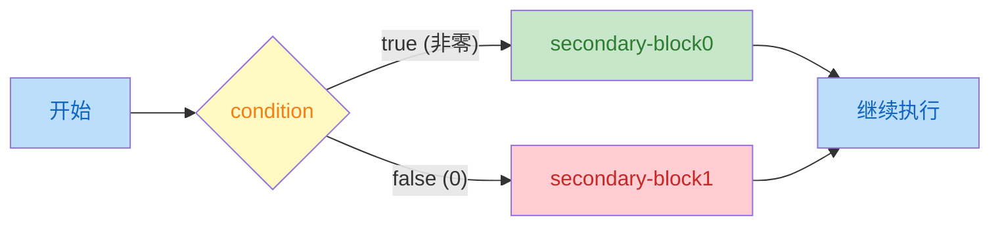
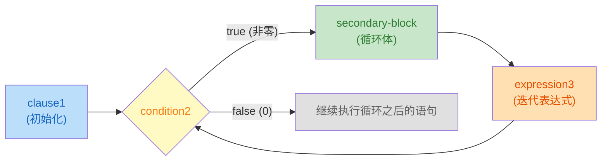
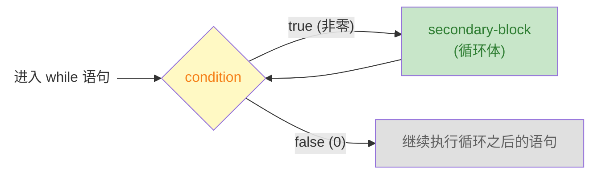
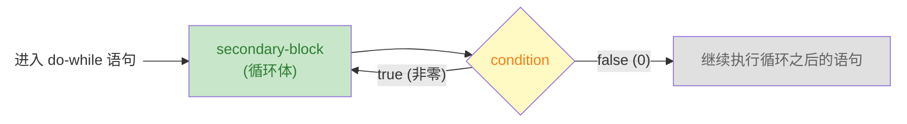

# Modern C 笔记：ch03-控制流

> 章节：第 3 章 · Everything Is About Control（控制流）  
> 日期：2026-07-25  
> 状态：☑ 已完成

---

## 📋 速览

C 语言通过六种控制结构来管理程序的执行路径。条件执行（`if`/`else`）根据表达式的真值从两条代码路径中二选一，C 的根基是"数值即真值"——零为假、非零为真，且所有标量类型（包括指针）都有真值。多路选择（`switch`）是级联 `if` 的替代方案，通过整型常量匹配跳转到对应 `case`，需注意 `break` 防止穿透。

三种迭代语句覆盖了不同场景：`for` 是域迭代的首选工具，初始化、条件、更新三合一；`while` 在迭代次数未知时更自然，先检查后执行；`do-while` 保证至少执行一次。`break` 和 `continue` 在循环内部提供额外的流程控制——前者终止整个循环，后者跳过本次迭代的剩余代码

---

## 📖 知识点

### 知识点 1：条件执行（Conditional Execution）— `if`

**是什么**

条件执行有 `if` 关键字引导。`if` 判断一个条件(`condition`)是真还是假，从两个可选代码路径中选择一个执行

**详细解释**

`if` 语句的完整形式如下(完整形式的 `if` 语句也称为选择语句：从两条代码路径中选择一条来执行)

```c
if (condition) secondary-block0 else secondary-block1
```

`if` 语句执行时，先计算 **控制表达式**（`condition`）的值；如果该表达式的值是 `true(1)`，则执行 `secondary-block0` 依赖块；否则，执行 `secondary-block1` 依赖块。这两个依赖块都应该是 `{...}` 包围的程序块



>  [!TIP]
>
>  `else` 部分对于 `if` 语句而言是可选的。因此，`if` 语句最简单的形式是
>
>  ```c
>  if (condition) secondary-block
>  ```
>
>  此时，`if` 语句的语义是根据控制表达式（`condition`）是真还是假，决定要不要执行这代码

**逻辑值**：虽然从 C23 开始有了 `bool` 类型，但 C 的根基还是 **数值即真值**(任何标量类型都有真值，指针也是标量)；遵循两条转换规则

| 值   | 逻辑含义      | 示例                                                         |
| ---- | ------------- | ------------------------------------------------------------ |
| 零值 | 假（`false`） | `int` `size_t` `double` 的 `0` 或 `0.0`；空指针 `NULL/nullptr` |
| 非零 | 真（`true`）  | `int` `size_t` `double` 的任何非零值; 非空指针               |

因此，在代码中如果需要检查数值是否等于 $0$，可以直接测试数值，而不是使用 `==`(判断相等) 和 `!=`(判断不相等)运算符与 $0$ 进行比较

```c
if (i != 0) { ... }  // i != 0 啰嗦
if (i) { ... }       // i 本身就可以作为条件 

if (i == 0) { ... }	// 啰嗦
if (!i) { ... }		// ! 表示取反，i 为 0 时 !i 的逻辑值是真
```

> **相等性判断**：C 使用 `==` 判断两个值是否相等；使用 `!=` 判断两个值是否不相等。
>
> 注意：数学上，运算符 `=` 用于进行相等性比较；但是，在 C 中，它作为了赋值运算符使用；如果我们误用它们，编译器不一定报错

从 C23 标准起，C 提供了 `bool` 类型和它两个字面值 `true` 和 `false`；它们的使用规则与数值条件完全一致

```c
bool done = false;
if (done) { ... }	// 不要使用 if (done == true)
```

> [!TIP]
>
> 不要拿布尔值与 0 `false` `true` 进行比较，直接使用它本身即可
>
> + `if (b) { ... }`
> + `if (!b) { ... }`
>
> 注意：如果你使用的编译器不支持 C23 标准，则需要 `#include <stdbool.h>`(C99标准引入，C23 标准废弃)

**嵌套的if语句**：C 标准对 `if` 语句的依赖块没有任何限制，它甚至可以是另一条 `if` 语句。例如，从三个数中找出其中的最大值，我们可能会写出下面的 `if` 语句

```c
if (i > j) {
    if (i > k) {
        max = i;
    } else {
        max = k;
    }
} else {
    if (j > k) {
        max = j;
    } else {
        max = k;
    }
}
```

`if` 语句的 `secondary-block` 只有一条语句时，不需要将其放在 `{ ... }` 中。

```c
if (i > j)
    if (i > k)
        max = i;
    else
        max = k;
else
    if (j > k)
        max = j;
    else
        max = k;
```

虽然，我们将每个 `else` 与它匹配 `if` 对齐排列，以提高可读性。但是，强烈建议始终保留花括号 `{...}` 这样可以避免 **悬空else** 问题。例如，`else` 的缩进暗示它与外层 `if` 匹配。但是，`else` 规则是就近匹配 `if` 

```c
if (y != 0)
    if (x != 0)
        result = x / y;
else	// ⬅ 整个 else 的缩进暗示它应该与最外层的 if 匹配。但是，C 规则是就近匹配
    printf("Error: y is equal to 0\n");
```

始终使用 `{ ... }` 包围每一个 `secondary-block` 可以最大层度的避免悬空 `else` 问题

```c
if (y != 0) {
    if (x != 0)
        result = x / y;
} else {
    printf("Error: y is equal to 0\n");
}

```

**级联 if**：这不是新语句，仅仅是 `if` 语句的 `else` 依赖块正好是另一个 `if` 语句的嵌套而已

```c
if (n < 0) {
    printf("n is less than 0\n");
} else if (n == 0) {
    printf("n is equal to 0\n");
} else {
    printf("n is greater than 0\n");
}
```

**代码示例**

下面的示例代码用于计算股票经纪人的佣金。佣金往往根据股票交易额采用某种变化的比例进行
计算，最低收费是 $39$ 美元，下表列出了实际支付给经纪人的费用金额

| 交易额范围            | 佣金             |
| --------------------- | ---------------- |
| 低于 2500 美元        | 30 美元 + 1.7%   |
| 2500 ~ 6250 美元      | 56 美元 + 0.66%  |
| 6250 ~ 20 000 美元    | 76 美元 + 0.34%  |
| 20 000 ~ 50 000 美元  | 100 美元 + 0.22% |
| 50 000 ~ 500 000 美元 | 155 美元 + 0.11% |
| 超过 500 000 美元     | 255 美元 + 0.09% |

```c
/*  broker.c - 计算股票经纪人的佣金  */

#include <stdio.h>
#include <stdlib.h>

int main(int argc, char* argv[argc + 1]) {
    if (argc != 2) {
        fprintf(stderr, "Usage: %s <trade>\n", argv[0]);
        return EXIT_FAILURE;
    }
    // 获取交易金额：字符串转换为数值
    double trade = strtod(argv[1], nullptr);
    double commission = {0.0};

    if (trade < 2500.0) {
        commission = 30.0 + trade * 0.017;
    } else if (trade < 6250.0) {
        commission = 56.0 + trade * 0.0066;
    } else if (trade < 20000.0) {
        commission = 76.0 + trade * 0.0034;
    } else if (trade < 50000.0) {
        commission = 100.0 + trade * 0.0022;
    } else if (trade < 500000.0) {
        commission = 155.0 + trade * 0.0011;
    } else {
        commission = 255.0 + trade * 0.0009;
    }

    if (commission < 39.0) {
        commission = 39.0;
    }

    printf("Trade is $%.2f commision is $%.2f\n", trade, commission);

    return EXIT_SUCCESS;
}
```

**练习**

- [x] **练习 1**：数值即真值 — 将以下 `if` 语句简化为 C 风格，不用比较运算符：
  ```c
  /* 原始版本 */            /* 简化版本 */
  if (x != 0) { ... }  →   if (x) { ... }
  if (count == 0) { ... }  →   if (!count) { ... }
  if (flag == true) { ... } →   if (flag) { ... }
  if (valid != false) { ... } → if (valid) { ... }
  ```
- [x] **练习 2**：if-else 填空 — 补全代码，实现：如果 `score >= 60`，打印"passed"，否则打印"failed"：
  
  ```c
  int score = 75;
  if (score >= 60) {
      printf("passed\n");
  } else {
      printf("failed\n");
  }
  ```
- [x] **练习 3**：悬空 else — 以下代码的输出是什么？`else` 实际上匹配哪个 `if`？
  
  ```c
  int x = 0, y = 1;
  if (x)
      if (y)
          printf("A\n");
  else
      printf("B\n");
  ```
  答案：`x = 0`  => false => 没有输出。`else` 就近匹配上内层的 `if`。最终的形式是
  ```c
  if (x) 
  	if (y) 
  		printf("A\n");
  	else
  		printf("B\n");
  ```
- [x] **练习 4**：找出三个数中的最大值，用嵌套 `if-else` 实现，保存到 `code/ch03/max3.c`
- [x] **练习 5**：完整程序 — 判断一个整数是正数、负数还是零，保存到 `code/ch03/sign.c`
- [x] **练习 6**：完整程序 — 输入一个年份，判断是否为闰年（能被 4 整除但不能被 100 整除，或者能被 400 整除），保存到 `code/ch03/leap.c`

---

### 知识点 2：`for` 循环

**是什么**

`for` 语句是 C 语言中 **域迭代**(让循环变量在某个范围内容变化)工具，它和 `if` 语句一样有一个控制表达式(`condition`)，该表达式的值决定了`for` 的依赖块是否执行

**详细解释**

`for` 循环我们已经在 `getting-started.c` 上见过了，但是只是简单介绍了一下。现在补齐 `for` 语句

```c
for (clause1; condition2; expression3) secondary-block
```

这四个部分各司其职：

| 部分    | 执行时机               | 做什么                               |
|---------|------------------------|--------------------------------------|
| `clause1`   | 循环开始前，只执行一次 | 设定起点——**通常是声明并初始化循环变量** |
| `condition2`   | 每次迭代前检查         | 值为真就继续，为假就退出             |
| `expression3` | 每次迭代结束后执行     | 更新循环变量，让它向终点靠近         |
| `secondary-block` | 条件为真时执行         | 循环体，真正重复干活的代码。通常是 `{...}` 程序块 |

下图描述了 `for` 循环的执行过程


> [!TIP]
> 1. `clause1` 应该始终是循环遍历的定义（不是赋值），这样循环遍历的作用域就被限制在 `for` 内部使用
> 2. `for` 的依赖块应该始终使用 `{...}` 包围。`for` 相比于 `if` 更复杂，使用括号可以区分循环体边界

**代码示例**

《Modern C》中给出了 $3$ 个 `for` 语句示例用法，每个都值得细看

> [!TIP]
>
> `size_t` 类型是 C 语言中的一种语义类型，它表示了**数量**和**大小**的概念，这种类型永远不会为负数

1. **倒着数**

    ```c
    for (size_t i = 10; i; --i) {
        something(i);
    }
    ```
    
    循环变量 `i` 从 $10$ 开始，条件是 `i`（数值即真值：`i` 非零时就是真，`i` 为零时就是假）。显然，当 `i` 为 $0$ 时，循环结束。这段代码从 $10$ 遍历到 $1$，共遍历 $10$ 次 

2. **两个循环变量**

    ```c
    for (size_t i = 0, stop = upper_bound(); i < stop; ++i) {
        something(i);
    }
    ```

    `clause1` 中声明两个循环变量。`stop` 只通过 `upper_bound()` 函数（耗时函数）计算一次，如果将 `upper_bound()` 写在条件中（`i < upper_bound()`），每次迭代都会重新调用，非常浪费性能

3. **看起来是死循环但不是**

    ```c
    
    for (size_t i = 9; i <= 9; --i) {
        something(i);
    }
    ```

    条件 `i <= 9` 看起来始终为真值，但其实不是。因为 `size_t` 是无符号的，当 `i = 0` 时，`--i` 不会变成 $-1$ ，而是回绕到 `SIZE_MAX`（取决于平台，但一定非常大）。此时，条件 `SIZE_MAX < 9` 一定为假，循环结束。所以，这段代码从 $9$ 遍历到 $0$，共遍历 $10$ 次

三个例子中的循环变量都叫 `i`，但它们的作用域各自独立、互不重叠：变量只在自己的 `for` 语句内可见

**练习**

- [x] **练习 1**：for 循环执行过程 — 根据以下 `for` 语句，写出 `i` 和 `result` 在每次迭代后的值：

  ```c
  size_t result = 0;
  for (size_t i = 1; i <= 4; ++i) {
      result = result * 10 + i;
  }
  // 迭代1: i=1, result=1
  // 迭代2: i=2, result=12
  // 迭代3: i=3, result=123
  // 迭代4: i=4, result=1234
  ```

- [x] **练习 2**：size_t 的回绕 — 以下代码中，第二个 `for` 循环会执行多少次？为什么？
  
  ```c
  for (size_t i = 9; i <= 9; --i) {
      printf("iteration: %zu\n", i);
  }
  ```
  提示：`size_t` 是无符号类型，当 `i = 0` 时执行 `--i` 会发生什么？

  
  答案：10 次。由于 `size_t` 是无符号的，当 `i = 0` 是 `--i` 会回绕，回到最大值 `SIZE_MAX`
  
- [x] **练习 3**：完整程序 — 用 `for` 循环打印 $1$ 到 $n$ 的平方，输出格式为三列表格（数字 | 平方），保存到 `code/ch03/table.c`

    > [!TIP]
    > 为了计算 $n^2$，我们首先观察一下 $(n-1)^2$
    > 
    > $$
    > (n-1)^2 = n^2 - 2n + 1
    > $$
    > 
    > 调整一下，我们就得到了
    > 
    > $$
    > n^2 = (n-1)^2 + (2n - 1)
    > $$
    > 很明显，$n^2$ 就可以拆分为 $(n-1)^2$ 在加上第 $n$ 个奇数，$n$ 从 $1$ 开始 
    
- [x] **练习 4**：完整程序 — 统计 $N$ 以内的素数个数，保存在 `code/ch03/primes.c` 和 `code/ch03/primes2.c`

    

    + `code/ch03/primes.c`：遍历所有的奇数，奇数的因子也只能是奇数，跳过 $5$ 的倍数（减少遍历次数）
    + `code/ch03/primes2.c`：孪生素数：对于素数 $p$,如果 $p+2$ 仍然是素数，称 $(p, p+2)$ 为孪生素数。除了特殊的 $(3,5)$ 之外，其他的孪生素数对都满足 $(6k-1, 6k+1),k=1,2...$ 。因此，我们可以依据孪生素数猜想对来生成目标值列表

---

### 知识点 3：`while` 循环

**是什么**

`while` 语句也是 C 语言的迭代语句，在不知道需要迭代多少次的情况下，`while` 语句就是最好的选择

**详细解释**

`while` 循环是可以看作 `for` 循环的简化版本；只需要一个控制表达式(`condition`) 和 `while` 语句的依赖块

```c
while (condition) secondary-block
```

`while` 语句的执行流程非常简单：先检查控制表达式，条件为 `true` 就执行 `secondary-block` 依赖块（和 `for` 一样，应该是 `{...}` 块），然后再次检查条件，直到条件为 `false` 为止。下图演示了 `while` 语句的执行流



`while` 语句与 `for` 语句的差异就是 `for` 语句把循环变量、控制表达式、更新循环变量三个职责打包在一起。然而，`while` 只负责检查控制表达式的值，循环变量的初始化和更新操作交给程序员自行控制

```c
// for 版本 — 三个职责打包
for (size_t i = 0; i < 10; ++i) { ... }

{
    // while 版本 — 拆开，各管各的
    size_t i = 0;          // 初始化：你自己写
    while (i < 10) {       // 条件：while 管
        ...
        ++i;               // 更新：你自己写
    }
} 
```

> [!TIP]
>
> 上述的示例代码中的 `for` 循环和 `while` 循环是等价的。因为，我们使用 `{...}` 将 `while` 循环需要的循环变量打包在一起了

所以，什么时候使用 `while` 循环而不是 `for` 循环呢？

+ **循环次数明确**、遍历一个范围 → `for`（域迭代）
+ **循环次数不确定**、靠某个条件控制 → `while`

**代码示例**

《Modern C》 中使用了 Heron 近似求倒数来说明什么时候用 `while` 语句

```c
double const a = 34.0;
double x = 0.5;
while (fabs(1.0 - a*x) >= ε) {    // 只要还没达到精度
	x *= (2.0 - a*x);              // 就继续逼近
}
```

这里要迭代多少次才能达到精度是不知道的，显然无法使用 `for` 循环，因为没有明确的迭代范围。最好的方法就是使用 `while` 一直迭代，直到满足要求为止

> [!WARNING]
>
> 注意：`while` 可能一次都不会执行。如果条件一开始就是 `false`，依赖块直接被跳过了

**练习**

- [x] **练习 1**：for → while 转换 — 将以下 `for` 循环改写为等价的 `while` 循环：

  ```c
  for (size_t i = 1; i <= 10; ++i) {
      printf("%zu\n", i * i);
  }
  // 等价的 while 循环
  {
      size_t i = 1;
      while (i <= 10) {
          printf("%zu\n", i * i);
          ++i;
      }
  }
  ```

- [x] **练习 2**：完整程序 — 用 `while` 循环求两个正整数的最大公约数（欧几里得算法：`gcd(a, b) = gcd(b, a % b)`，直到余数为 0），保存到 `code/ch03/gcd.c`

- [x] **练习 3**：完整程序 — 用 `while` 循环分解一个整数的各位数字并求和（如输入 1234，输出 1+2+3+4=10），保存到 `code/ch03/digitsum.c`

- [x] **练习 4**：完整程序 — 使用快速幂计算 $a^n$，保存到 `code/ch03/power.c`

    

    > [!TIP]
    > 计算一个数 $x$ 的 $m$ 次幂最简单的方式就是直接将 $x$ 乘以 $m$ 次。但是，当 $m$ 较大时，程序需要连续计算 $m$ 次乘法。为了减少乘法的计算量，我们关注 $m$ 的二进制表示。假设 $m = 13$ 其二进制表示为 $m=(1101)_2$，因此，我们有
    > $$
    > x^{13} = x^{2^3+2^2+2^0} = x^{2^3}\cdot x^{2^2} \cdot x^{2^0}
    > $$
    >
    > 这个算法可以这样进行下去
    >
    > + 初始化结果 `res = 1`，底数 `base = x`，指数 `m = 13`。
    > + 循环直到 `m = 0`
    >     + 如果 `m & 1 == 1`，则 `res *= base`
    >     + `base = base * base` （平方）
    >     + `m >>= 1` （右移一位）

---

### 知识点 4：`do-while` 循环

**是什么**

`do-while` 与 `while` 几乎是一样的，也是在不知道需要迭代多少次的前提下使用。但是，`do-while` 的循环体至少执行一次

**详细解释**

`do-while` 和 `while` 的差异在于控制表达式的检查时机不同

```c
do secondary-block while (condition); // 注意：这里的分号(;) 一定不能少，它是 do-while 语的结束标记
```

`do-while` 的执行顺序是：先执行 `secondary-block` 依赖块（通常是 `{...}` 块），再检查控制表达式(`condition`)。该表达式的值为 `true`，就回头继续执行；否则，退出循环



> [!TIP]
>
> `do-while` 保证 `secondary-block` 至少执行一次，即使最初的控制表达式的值为 `false`。

使用 `do-while` 的典型场景是"**至少要做一次**，然后根据结果决定要不要继续"

**代码示例**

《Modern C》 中也是用 Heron 近似求给定数的倒数来对比的

```c
// while 版本 — 先检查，可能 0 次
while (fabs(1.0 - a*x) >= ε) {
    x *= (2.0 - a * x);
}

// do-while 版本 — 先执行，至少 1 次
do {
    x *= (2.0 - a * x);
} while (fabs(1.0 - a*x) >= ε);
```

> 如果初始 `x` 刚好满足精度，`while` 直接结束，`do-while` 还是会计算一次。

**练习**

- [x] **练习 1**：while → do-while 转换 — 以下 `while` 循环每次迭代前都要先检查 `n > 0`。如果已知 `n` 至少为 1，改写为 `do-while` 会更自然。请改写：

  ```c
  size_t n = 10;
  while (n > 0) {
      printf("%zu\n", n);
      --n;
  }
  // do-while 版本
  size_t n = 10;
  do {
      printf("%zu\n", n);
      --n;
  } while (n >= 1);
  ```

- [x] **练习 2**：完整程序 — 用 `do-while` 循环实现输入校验：反复提示用户输入一个 1~100 之间的正整数，直到输入合法为止，然后打印该数字，保存到 `code/ch03/validate.c`

- [x] **练习 3**：完整程序 — 用 `do-while` 循环实现一个简易菜单：显示选项（1. 打招呼 2. 报时 3. 退出），根据用户选择执行对应操作，直到用户选择退出，保存到 `code/ch03/menu.c`

---

### 知识点 5：`break` 和 `continue` 语句

**是什么**

`break` 和 `continue` 这两个关键字在循环内部控制循环的执行；它们是与 `for` `while` `do-while` 是关联在一起的。循环就像是流水线，`break` 和 `continue` 就是用于控制流水线的按钮

**详细解释**

`break` 会立即终止它所在的循环，就像直接给流水线断电一样；`break` 一旦执行，循环立即停止，不再检查控制表达式也不再执行 `break` 后面的代码。而是直接跳转到循环体外的下一条语句开始

```c
while (...) {
    ...;
    break;  // ⬅ 循环立即结束
    ....;	// ⬅ break 后面的代码永远不会执行
}
```

`continue` 跳过本次迭代，继续下一次。它不终止循环，只是说 **这次不做了，下一个**

```c
for (size_t i = 0; i < 10; ++i) {
    ...
    continue;   // ← 跳过本次迭代的剩余代码
    ...         // ← 这行不会执行
    // 但 ++i 照常执行，然后重新检查 i < 10
}
```

执行 `continue` 会跳过循环体中的剩余代码。对于 `for` 语句而言，`continue` 会直接去执行条件更新操作(例如 `++i`)，因为它不属于循环体；对于 `while` 和 `do-while` 而言，`continue` 就直接回到条件检查

下表总结了 `break` 和 `continue` 对循环的控制方式以及何时使用

| 关键字     | 做什么                           | 用在               |
| ---------- | -------------------------------- | ------------------ |
| `break`    | 终止整个循环，不再回头           | 达到目标、提前退出 |
| `continue` | 跳过本次迭代剩余代码，进入下一次 | 跳过不合适的迭代   |


**代码示例**

《Modern C》中的演示 `break` 例子还是 Heron 近似，但是它把条件从 `while` 的控制表达式移到循环体内部

```c
while (true) {
    double prod = a * x;
    if (fabs(1.0 - prod) < ε) {   // 精度够了吗？
        break;                      // 够了 → 跳出
    }
    x *= (2.0 - prod);             // 不够 → 继续逼近
}
```

这种写法的好处是把"计算-判断-更新"三步拆开，逻辑更清晰。`while (true)` 表示"理论上无限循环"，但 `break` 在合适的时候终止它

> [!NOTE]
>
> `for` 循环可以任意省略位于 `(...)` 中的三部分，但是每个部分之间的分号(`;`)必须保留。
>
> ```c
> for (;;) {
>     ...;
>     if (条件) break;
>     ...;
> }
> ```
>
> 如果 `for` 的控制表达式省略时被解释为 **"永远为真"**，与 `while(true)` 等价的。至于选择哪一个取决于人类程序员编写程序的风格和爱好

《Modern C》中的演示 `continue` 例子也是是 Heron 近似的扩展：加一个检查，如果 `x` 跑到了 $1$ 的另一侧就先调整回来

```c
for (size_t i = 0; i < max_iterations; ++i) {
    if (x > 1.0) {          // 跑到 1 的右边去了
        x = 1.0 / x;        // 拉回左边
        continue;           // 跳过这次迭代的逼近计算
    }
    double prod = a * x;
    if (fabs(1.0 - prod) < ε) break;
    x *= (2.0 - prod);
}
```


**练习**

- [x] **练习 1**：break 输出预测 — 以下代码的输出是什么？

  ```c
  for (size_t i = 0; i < 10; ++i) {
      if (i == 5) break;
      printf("%zu ", i);
  }
  // 答案：0 1 2 3 4
  ```

- [x] **练习 2**：continue 输出预测 — 以下代码的输出是什么？

  ```c
  for (size_t i = 0; i < 10; ++i) {
      if (i % 2 == 0) continue;
      printf("%zu ", i);
  }
  // 答案：1 3 5 7 9
  ```

- [x] **练习 3**：完整程序 — 用 `while (true)` + `break` 实现：反复读取用户输入的整数，累加求和。当用户输入 0 时终止并打印总和，保存到 `code/ch03/sum_until_zero.c`

---

### 知识点 6：多路选择（Multiple Selections）— `switch`

**是什么**

`switch` 是 C 的多路选择语句。用于解决 **级联 if** 过长时导致代码不清晰问题

**详细解释**

从语法上讲，`switch` 的形式非常简单

```c
switch (expression) secondary-block
```

需要注意的是

+ `expression` 必须是 **整型表达式**；也就是说，`expression` 表达式的值必须是一个整数
+ `secondary-block` 是 `switch` 的依赖块，其中是系列 `case label` 集合。每一个 `label` 都必须 **整数常量表达式**(Integer Constant Expression,**ICE**)

每一个 `case label` 都代表了一种需要匹配的情况。当 `switch` 语句执行时，将 `expression` 表达式的值直接与 `label` 的值进行匹配；*匹配成功* 就跳转到 `case label` 开始的语句执行，直到遇见 `break` 或 `switch` 语句结束；*匹配失败* 就跳转到 `default` 开始的语句执行，如果没有 `default`，则直接退出

+ 每个 `case label` 标签的最后一条语句都应该是 `break` 语句；否则，将出现 **case穿透** 的情形。如果确实需要利用case穿透，应该使用 `[[fallthrough]]` 属性(C23起)标记我们正在利用case穿透
+ 每个 `case label` 标签应该**唯一**，否则编译器会禁止编译

完整形式的 `switch` 语句应该是

```c
switch(expression) {
    case ICE: statements
    ....
    case ICE: statements
    default: statements
}
```

> [!TIP]
>
> 一般情况下，`default` 标签都会放在依赖块的最后。当然，也可以放在其他位置，这时候的 `default` 情形就不应丢失 `break` 语句

`case label` 的语句序列是 C 语言中少数不需要 `{...}` 的位置；但是，如果需要在 `case label` 中定义变量时，则必须使用 `{...}` 块来组织该情形下的语句序列：**case 标签不能跳过变量定义**

**代码示例**

《Modern C》 中用于演示 级联 `if` 和 `switch` 的示例代码

```c
// if-else 级联 — 冗长
if (arg == 'm')      puts("magpie");
else if (arg == 'r') puts("raven");
else if (arg == 'j') puts("jay");
else if (arg == 'c') puts("chough");
else                 puts("unknown");

// switch — 一目了然
switch (arg) {
    case 'm': puts("magpie"); break;
    case 'r': puts("raven");  break;
    case 'j': puts("jay");    break;
    case 'c': puts("chough"); break;
    default:  puts("unknown");
}
```

级联 `if` 看起来比较吃力，需要识别每种情形的条件；然而，`switch` 做的是 `case` 匹配，不需要检查条件。

`switch` 语句的每个 `case` 的最后一条语句都应该是 `break`；否则会出现 **case穿透** 情形；一般情况下，这种情形都不是我们需要的。

```c
switch (count) {
    default: puts("++++ ..... +++");
    case 4:  puts("++++");
    case 3:  puts("+++");
    case 2:  puts("++");
    case 1:  puts("+");
    case 0:  // 空
}
```

当 `count = 3` 时：跳转到 `case 3`，输出 `+++`，因为没有 `break`，继续穿透；最终输出的结果是

``` 
+++
++
+
```

注意：`case` 标签不允许跳过变量定义：下面的示例是错误示范

```c
switch (x) {
    unsigned tmp = 45;    // ← 当 x=0 时，这行被跳过
    case 0:
        printf("%u\n", tmp);  // tmp 未初始化！
}
```

**练习**

- [x] **练习 1**：if-else → switch 转换 — 将以下级联 `if` 改写为 `switch`：

  ```c
  if (grade == 'A')      puts("优秀");
  else if (grade == 'B') puts("良好");
  else if (grade == 'C') puts("及格");
  else if (grade == 'D') puts("不及格");
  else                   puts("无效等级");
  // switch 版本
  switch (grade) {
      case 'A':
          puts("优秀");
          break;
      case 'B':
         	puts("良好");
          break;
      case 'C':
          puts("及格");
          break;
      case 'D':
          puts("不及格");
          break;
      default:
          puts("无效等级");
  }
  ```

- [x] **练习 2**：fall-through 输出预测 — 以下代码的输出是什么？

  ```c
  int n = 2;
  switch (n) {
      case 1: printf("A ");
      case 2: printf("B ");
      case 3: printf("C ");
      default: printf("D");
  }
  // 答案：B C D
  ```

- [x] **练习 3**：完整程序 — 用 `switch` 实现一个简单的四则运算计算器：输入两个数和运算符（+ - * /），输出计算结果。除法需检查除数为 0，保存到 `code/ch03/calculator.c`

---

## 📝 章节练习

| 编号 | 题目 | 难度 | 完成 |
|------|------|------|------|
| 1 | 用 `for` 循环实现阶乘计算：输入一个正整数 n，输出 n!（n 的阶乘），保存到 `code/ch03/factorial.c`。提示：`size_t` 类型可能溢出，考虑如何处理(已完成) | ⭐⭐ | ☑ |
| 2 | 用 `while` 循环实现：输入一个正整数，反复除以 10 直到变为 0，统计这个数字有几位（如 12345 为 5 位），保存到 `code/ch03/numdigits.c` (已完成) | ⭐⭐ | ☑ |
| 3 | 用 `do-while` 循环实现猜数字游戏：程序随机生成一个 1~100 的数，反复提示用户猜，每次告知"大了"或"小了"，直到猜中，统计猜测次数并打印，保存到 `code/ch03/guess.c` (已完成) | ⭐⭐ | ☑ |

---

## 🤔 疑问记录

| 编号 | 疑问 | 状态 |
|------|------|------|
| 1 | `size_t` 类型执行 `--i` 到 0 以下时为何回绕到 `SIZE_MAX` 而不是变成负数？(``-1` 的位模式全为 `1` 但 `size_t` 类型按照无符号解释为 `SIZE_MAX`)无符号整数溢出的底层机制是什么？(将结果与 `SIZE_MAX + 1`取模，即 `% (SIZE_MAX + 1)`) | ☑ 已解答 |
| 2 | `for`、`while`、`do-while` 三种循环可以完全互相替代吗？如果可以，为什么 C 还要提供三种？(答案：`for` 和 `while` 可以相互替代，`do-while` 虽然也可以使用其他循环替代，但是通常不会这么做。提供三种循环是为了适应不同的使用场景) | ☑ 已解答 |
| 3 | `switch` 的 fall-through 是刻意设计还是语言缺陷？（答案：并非语言缺陷，而是故意设计的特性）除了教材的三角形示例，还有哪些有意利用穿透的场景？（答案：1. 多个 case 共享同一处理，如 `case 'a': case 'A':` 大小写不敏感匹配；2. 范围映射，如 `case 10: case 9:` 映射到同一等级；3. 状态机/解析器中每个 `case` 处理完当前阶段后自然落到下一阶段） | ☑ 已解答 |


---

## ✅ 自检

- [ ] 能解释"数值即真值"的含义，正确使用 `if (x)` 替代 `if (x != 0)`，理解无符号整数溢出按 `SIZE_MAX+1` 取模回绕
- [ ] 能写出 `for` 循环的四个组成部分，能根据场景选择合适的循环（次数明确→`for`，次数未知→`while`，至少一次→`do-while`）
- [ ] 理解 `switch` 的 fall-through 是刻意设计，能列举三种有意利用穿透的场景（多 case 共享、范围映射、状态机）
- [ ] 能熟练使用 `break` 提前终止循环，用 `continue` 跳过当前迭代
- [ ] 知道 `case` 标签的值必须是整型常量表达式，且不能跳过变量定义
