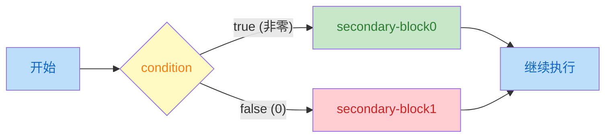

# 条件执行

> 章节：第 3 章 · Everything Is About Control（控制流）  
> 日期：2026-07-25  
> 状态：

---

## 📋 速览

C 语言通过六种控制结构来管理程序的执行路径。条件执行（`if`/`else`）根据表达式的真值从两条代码路径中二选一，C 的根基是"数值即真值"——零为假、非零为真，且所有标量类型（包括指针）都有真值。多路选择（`switch`）是级联 `if` 的替代方案，通过整型常量匹配跳转到对应 `case`，需注意 `break` 防止穿透。

三种迭代语句覆盖了不同场景：`for` 是域迭代的首选工具，初始化、条件、更新三合一；`while` 在迭代次数未知时更自然，先检查后执行；`do-while` 保证至少执行一次。`break` 和 `continue` 在循环内部提供额外的流程控制——前者终止整个循环，后者跳过本次迭代的剩余代码

---

## 📖 知识点


### 知识点 1：条件执行（Conditional Execution）— `if` 


**是什么**

条件执行有 `if` 关键字引导。`if` 判断一个条件(`condition`)是真还是假，从两个可选代码路径中选择一个执行

**详细解释**

`if` 语句的完整形式如下(完整形式的 `if` 语句也称为选择语句：从两条代码路径中选择一条来执行)

```c
if (condition) secondary-block0 else secondary-block1
```

`if` 语句执行时，先计算 **控制表达式**（`condition`）的值；如果该表达式的值是 `true(1)`，则执行 `secondary-block0` 依赖块；否则，执行 `secondary-block1` 依赖块。这两个依赖块都应该是 `{...}` 包围的程序块



>  [!TIP]
>
>  `else` 部分对于 `if` 语句而言是可选的。因此，`if` 语句最简单的形式是
>
>  ```c
>  if (condition) secondary-block
>  ```
>
>  此时，`if` 语句的语义是根据控制表达式（`condition`）是真还是假，决定要不要执行这代码

**逻辑值**：虽然从 C23 开始有了 `bool` 类型，但 C 的根基还是 **数值即真值**(任何标量类型都有真值，指针也是标量)；遵循两条转换规则

| 值   | 逻辑含义      | 示例                                                         |
| ---- | ------------- | ------------------------------------------------------------ |
| 零值 | 假（`false`） | `int` `size_t` `double` 的 `0` 或 `0.0`；空指针 `NULL/nullptr` |
| 非零 | 真（`true`）  | `int` `size_t` `double` 的任何非零值; 非空指针               |

因此，在代码中如果需要检查数值是否等于 $0$，可以直接测试数值，而不是使用 `==`(判断相等) 和 `!=`(判断不相等)运算符与 $0$ 进行比较

```c
if (i != 0) { ... }  // i != 0 啰嗦
if (i) { ... }       // i 本身就可以作为条件 

if (i == 0) { ... }	// 啰嗦
if (!i) { ... }		// ! 表示取反，i 为 0 时 !i 的逻辑值是真
```

> **相等性判断**：C 使用 `==` 判断两个值是否相等；使用 `!=` 判断两个值是否不相等。
>
> 注意：数学上，运算符 `=` 用于进行相等性比较；但是，在 C 中，它作为了赋值运算符使用；如果我们误用它们，编译器不一定报错

从 C23 标准起，C 提供了 `bool` 类型和它两个字面值 `true` 和 `false`；它们的使用规则与数值条件完全一致

```c
bool done = false;
if (done) { ... }	// 不要使用 if (done == true)
```

> [!TIP]
>
> 不要拿布尔值与 0 `false` `true` 进行比较，直接使用它本身即可
>
> + `if (b) { ... }`
> + `if (!b) { ... }`
>
> 注意：如果你使用的编译器不支持 C23 标准，则需要 `#include <stdbool.h>`(C99标准引入，C23 标准废弃)

**嵌套的if语句**：C 标准对 `if` 语句的依赖块没有任何限制，它甚至可以是另一条 `if` 语句。例如，从三个数中找出其中的最大值，我们可能会写出下面的 `if` 语句

```c
if (i > j) {
    if (i > k) {
        max = i;
    } else {
        max = k;
    }
} else {
    if (j > k) {
        max = j;
    } else {
        max = k;
    }
}
```

`if` 语句的 `secondary-block` 只有一条语句时，不需要将其放在 `{ ... }` 中。

```c
if (i > j)
    if (i > k)
        max = i;
    else
        max = k;
else
    if (j > k)
        max = j;
    else
        max = k;
```

虽然，我们将每个 `else` 与它匹配 `if` 对齐排列，以提高可读性。但是，强烈建议始终保留花括号 `{...}` 这样可以避免 **悬空else** 问题。例如，`else` 的缩进暗示它与外层 `if` 匹配。但是，`else` 规则是就近匹配 `if` 

```c
if (y != 0)
    if (x != 0)
        result = x / y;
else	// ⬅ 整个 else 的缩进暗示它应该与最外层的 if 匹配。但是，C 规则是就近匹配
    printf("Error: y is equal to 0\n");
```

始终使用 `{ ... }` 包围每一个 `secondary-block` 可以最大层度的避免悬空 `else` 问题

```c
if (y != 0) {
    if (x != 0)
        result = x / y;
} else {
    printf("Error: y is equal to 0\n");
}

```

**级联 if**：这不是新语句，仅仅是 `if` 语句的 `else` 依赖块正好是另一个 `if` 语句的嵌套而已

```c
if (n < 0) {
    printf("n is less than 0\n");
} else if (n == 0) {
    printf("n is equal to 0\n");
} else {
    printf("n is greater than 0\n");
}
```

**代码示例**

下面的示例代码用于计算股票经纪人的佣金。佣金往往根据股票交易额采用某种变化的比例进行
计算，最低收费是 $39$ 美元，下表列出了实际支付给经纪人的费用金额

| 交易额范围            | 佣金             |
| --------------------- | ---------------- |
| 低于 2500 美元        | 30 美元 + 1.7%   |
| 2500 ~ 6250 美元      | 56 美元 + 0.66%  |
| 6250 ~ 20 000 美元    | 76 美元 + 0.34%  |
| 20 000 ~ 50 000 美元  | 100 美元 + 0.22% |
| 50 000 ~ 500 000 美元 | 155 美元 + 0.11% |
| 超过 500 000 美元     | 255 美元 + 0.09% |

```c
/*  broker.c - 计算股票经纪人的佣金  */

#include <stdio.h>
#include <stdlib.h>

int main(int argc, char* argv[argc + 1]) {
    if (argc != 2) {
        fprintf(stderr, "Usage: %s <trade>\n", argv[0]);
        return EXIT_FAILURE;
    }
    // 获取交易金额：字符串转换为数值
    double trade = strtod(argv[1], nullptr);
    double commission = {0.0};

    if (trade < 2500.0) {
        commission = 30.0 + trade * 0.017;
    } else if (trade < 6250.0) {
        commission = 56.0 + trade * 0.0066;
    } else if (trade < 20000.0) {
        commission = 76.0 + trade * 0.0034;
    } else if (trade < 50000.0) {
        commission = 100.0 + trade * 0.0022;
    } else if (trade < 500000.0) {
        commission = 155.0 + trade * 0.0011;
    } else {
        commission = 255.0 + trade * 0.0009;
    }

    if (commission < 39.0) {
        commission = 39.0;
    }

    printf("Trade is $%.2f commision is $%.2f\n", trade, commission);

    return EXIT_SUCCESS;
}
```

**练习**

- [x] **练习 1**：数值即真值 — 将以下 `if` 语句简化为 C 风格，不用比较运算符：
  ```c
  /* 原始版本 */            /* 简化版本 */
  if (x != 0) { ... }  →   if (x) { ... }
  if (count == 0) { ... }  →   if (!count) { ... }
  if (flag == true) { ... } →   if (flag) { ... }
  if (valid != false) { ... } → if (valid) { ... }
  ```
- [x] **练习 2**：if-else 填空 — 补全代码，实现：如果 `score >= 60`，打印"passed"，否则打印"failed"：
  
  ```c
  int score = 75;
  if (score >= 60) {
      printf("passed\n");
  } else {
      printf("failed\n");
  }
  ```
- [x] **练习 3**：悬空 else — 以下代码的输出是什么？`else` 实际上匹配哪个 `if`？
  
  ```c
  int x = 0, y = 1;
  if (x)
      if (y)
          printf("A\n");
  else
      printf("B\n");
  ```
  答案：`x = 0`  => false => 没有输出。`else` 就近匹配上内层的 `if`。最终的形式是
  ```c
  if (x) 
  	if (y) 
  		printf("A\n");
  	else
  		printf("B\n");
  ```
- [x] **练习 4**：找出三个数中的最大值，用嵌套 `if-else` 实现，保存到 `code/ch03/max3.c`
- [x] **练习 5**：完整程序 — 判断一个整数是正数、负数还是零，保存到 `code/ch03/sign.c`
- [x] **练习 6**：完整程序 — 输入一个年份，判断是否为闰年（能被 4 整除但不能被 100 整除，或者能被 400 整除），保存到 `code/ch03/leap.c`

  ```c
  // max3.c 核心逻辑
  if (a > b) { max = (a > c) ? a : c; }
  else       { max = (b > c) ? b : c; }
  
  // sign.c 核心逻辑
  if (n > 0)      puts("positive");
  else if (n < 0) puts("negative");
  else            puts("zero");
  
  // leap.c 核心逻辑
  if ((year % 400 == 0) || (year % 4 == 0 && year % 100 != 0))
      puts("leap year");
  else puts("not leap year");
  ```

---

