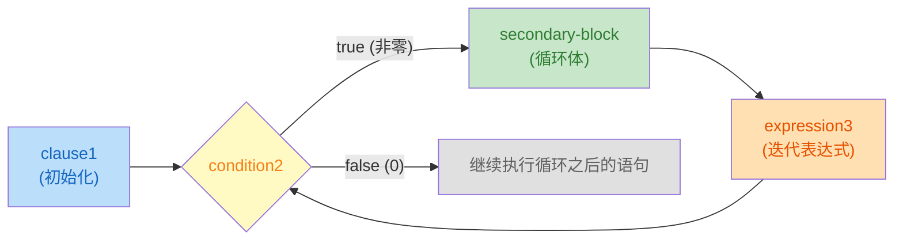

# Modern C 笔记：ch03-控制流

> 章节：第 3 章 · Everything Is About Control（控制流）  
> 日期：2026-07-25  
> 状态：☑ 已完成

---

## 📋 速览

C 语言通过六种控制结构来管理程序的执行路径。条件执行（`if`/`else`）根据表达式的真值从两条代码路径中二选一，C 的根基是"数值即真值"——零为假、非零为真，且所有标量类型（包括指针）都有真值。多路选择（`switch`）是级联 `if` 的替代方案，通过整型常量匹配跳转到对应 `case`，需注意 `break` 防止穿透。

三种迭代语句覆盖了不同场景：`for` 是域迭代的首选工具，初始化、条件、更新三合一；`while` 在迭代次数未知时更自然，先检查后执行；`do-while` 保证至少执行一次。`break` 和 `continue` 在循环内部提供额外的流程控制——前者终止整个循环，后者跳过本次迭代的剩余代码

---

## 📖 知识点


### 知识点 2：`for` 循环 ☑ 已完成


**是什么**

`for` 语句是 C 语言中 **域迭代**(让循环变量在某个范围内容变化)工具，它和 `if` 语句一样有一个控制表达式(`condition`)，该表达式的值决定了`for` 的依赖块是否执行

**详细解释**

`for` 循环我们已经在 `getting-started.c` 上见过了，但是只是简单介绍了一下。现在补齐 `for` 语句

```c
for (clause1; condition2; expression3) secondary-block
```

这四个部分各司其职：

| 部分    | 执行时机               | 做什么                               |
|---------|------------------------|--------------------------------------|
| `clause1`   | 循环开始前，只执行一次 | 设定起点——**通常是声明并初始化循环变量** |
| `condition2`   | 每次迭代前检查         | 值为真就继续，为假就退出             |
| `expression3` | 每次迭代结束后执行     | 更新循环变量，让它向终点靠近         |
| `secondary-block` | 条件为真时执行         | 循环体，真正重复干活的代码。通常是 `{...}` 程序块 |

下图描述了 `for` 循环的执行过程


> [!TIP]
> 1. `clause1` 应该始终是循环遍历的定义（不是赋值），这样循环遍历的作用域就被限制在 `for` 内部使用
> 2. `for` 的依赖块应该始终使用 `{...}` 包围。`for` 相比于 `if` 更复杂，使用括号可以区分循环体边界

**代码示例**

《Modern C》中给出了 $3$ 个 `for` 语句示例用法，每个都值得细看

> [!TIP]
>
> `size_t` 类型是 C 语言中的一种语义类型，它表示了**数量**和**大小**的概念，这种类型永远不会为负数

1. **倒着数**

    ```c
    for (size_t i = 10; i; --i) {
        something(i);
    }
    ```
    
    循环变量 `i` 从 $10$ 开始，条件是 `i`（数值即真值：`i` 非零时就是真，`i` 为零时就是假）。显然，当 `i` 为 $0$ 时，循环结束。这段代码从 $10$ 遍历到 $1$，共遍历 $10$ 次 

2. **两个循环变量**

    ```c
    for (size_t i = 0, stop = upper_bound(); i < stop; ++i) {
        something(i);
    }
    ```

    `clause1` 中声明两个循环变量。`stop` 只通过 `upper_bound()` 函数（耗时函数）计算一次，如果将 `upper_bound()` 写在条件中（`i < upper_bound()`），每次迭代都会重新调用，非常浪费性能

3. **看起来是死循环但不是**

    ```c
    
    for (size_t i = 9; i <= 9; --i) {
        something(i);
    }
    ```

    条件 `i <= 9` 看起来始终为真值，但其实不是。因为 `size_t` 是无符号的，当 `i = 0` 时，`--i` 不会变成 $-1$ ，而是回绕到 `SIZE_MAX`（取决于平台，但一定非常大）。此时，条件 `SIZE_MAX < 9` 一定为假，循环结束。所以，这段代码从 $9$ 遍历到 $0$，共遍历 $10$ 次

三个例子中的循环变量都叫 `i`，但它们的作用域各自独立、互不重叠：变量只在自己的 `for` 语句内可见

**练习**

- [x] **练习 1**：for 循环执行过程 — 根据以下 `for` 语句，写出 `i` 和 `result` 在每次迭代后的值：

  ```c
  size_t result = 0;
  for (size_t i = 1; i <= 4; ++i) {
      result = result * 10 + i;
  }
  // 迭代1: i=1, result=1
  // 迭代2: i=2, result=12
  // 迭代3: i=3, result=123
  // 迭代4: i=4, result=1234
  ```

- [x] **练习 2**：size_t 的回绕 — 以下代码中，第二个 `for` 循环会执行多少次？为什么？
  
  ```c
  for (size_t i = 9; i <= 9; --i) {
      printf("iteration: %zu\n", i);
  }
  ```
  提示：`size_t` 是无符号类型，当 `i = 0` 时执行 `--i` 会发生什么？

  
  答案：10 次。由于 `size_t` 是无符号的，当 `i = 0` 是 `--i` 会回绕，回到最大值 `SIZE_MAX`
  
- [x] **练习 3**：完整程序 — 用 `for` 循环打印 $1$ 到 $n$ 的平方，输出格式为三列表格（数字 | 平方），保存到 `code/ch03/table.c`

    > [!TIP]
    > 为了计算 $n^2$，我们首先观察一下 $(n-1)^2$
    > 
    > $$
    > (n-1)^2 = n^2 - 2n + 1
    > $$
    > 
    > 调整一下，我们就得到了
    > 
    > $$
    > n^2 = (n-1)^2 + (2n - 1)
    > $$
    > 很明显，$n^2$ 就可以拆分为 $(n-1)^2$ 在加上第 $n$ 个奇数，$n$ 从 $1$ 开始 
    
- [x] **练习 4**：完整程序 — 统计 $N$ 以内的素数个数，保存在 `code/ch03/primes.c` 和 `code/ch03/primes2.c`

    

    + `code/ch03/primes.c`：遍历所有的奇数，奇数的因子也只能是奇数，跳过 $5$ 的倍数（减少遍历次数）
    + `code/ch03/primes2.c`：孪生素数：对于素数 $p$,如果 $p+2$ 仍然是素数，称 $(p, p+2)$ 为孪生素数。除了特殊的 $(3,5)$ 之外，其他的孪生素数对都满足 $(6k-1, 6k+1),k=1,2...$ 。因此，我们可以依据孪生素数猜想对来生成目标值列表

  ```c
  // primes.c 核心逻辑：只检查奇数，跳过 5 的倍数
  for (int target = 3; target <= N; target += 2) {
      if (target != 5 && !(target % 5)) continue;
      bool prime = true;
      for (int f = 3; f * f <= target; f += 2)
          if (!(target % f)) { prime = false; break; }
      if (prime) ++count;
  }
  ```

---

