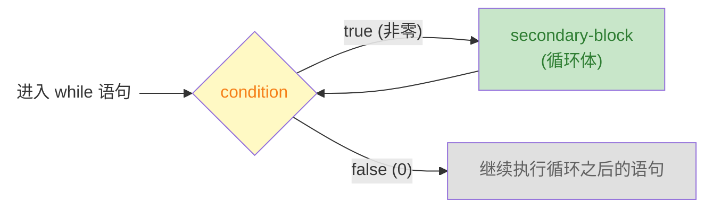

# Modern C 笔记：ch03-控制流

> 章节：第 3 章 · Everything Is About Control（控制流）  
> 日期：2026-07-25  
> 状态：

---

## 📋 速览

C 语言通过六种控制结构来管理程序的执行路径。条件执行（`if`/`else`）根据表达式的真值从两条代码路径中二选一，C 的根基是"数值即真值"——零为假、非零为真，且所有标量类型（包括指针）都有真值。多路选择（`switch`）是级联 `if` 的替代方案，通过整型常量匹配跳转到对应 `case`，需注意 `break` 防止穿透。

三种迭代语句覆盖了不同场景：`for` 是域迭代的首选工具，初始化、条件、更新三合一；`while` 在迭代次数未知时更自然，先检查后执行；`do-while` 保证至少执行一次。`break` 和 `continue` 在循环内部提供额外的流程控制——前者终止整个循环，后者跳过本次迭代的剩余代码

---

## 📖 知识点


### 知识点 3：`while` 循环 


**是什么**

`while` 语句也是 C 语言的迭代语句，在不知道需要迭代多少次的情况下，`while` 语句就是最好的选择

**详细解释**

`while` 循环是可以看作 `for` 循环的简化版本；只需要一个控制表达式(`condition`) 和 `while` 语句的依赖块

```c
while (condition) secondary-block
```

`while` 语句的执行流程非常简单：先检查控制表达式，条件为 `true` 就执行 `secondary-block` 依赖块（和 `for` 一样，应该是 `{...}` 块），然后再次检查条件，直到条件为 `false` 为止。下图演示了 `while` 语句的执行流



`while` 语句与 `for` 语句的差异就是 `for` 语句把循环变量、控制表达式、更新循环变量三个职责打包在一起。然而，`while` 只负责检查控制表达式的值，循环变量的初始化和更新操作交给程序员自行控制

```c
// for 版本 — 三个职责打包
for (size_t i = 0; i < 10; ++i) { ... }

{
    // while 版本 — 拆开，各管各的
    size_t i = 0;          // 初始化：你自己写
    while (i < 10) {       // 条件：while 管
        ...
        ++i;               // 更新：你自己写
    }
} 
```

> [!TIP]
>
> 上述的示例代码中的 `for` 循环和 `while` 循环是等价的。因为，我们使用 `{...}` 将 `while` 循环需要的循环变量打包在一起了

所以，什么时候使用 `while` 循环而不是 `for` 循环呢？

+ **循环次数明确**、遍历一个范围 → `for`（域迭代）
+ **循环次数不确定**、靠某个条件控制 → `while`

**代码示例**

《Modern C》 中使用了 Heron 近似求倒数来说明什么时候用 `while` 语句

```c
double const a = 34.0;
double x = 0.5;
while (fabs(1.0 - a*x) >= ε) {    // 只要还没达到精度
	x *= (2.0 - a*x);              // 就继续逼近
}
```

这里要迭代多少次才能达到精度是不知道的，显然无法使用 `for` 循环，因为没有明确的迭代范围。最好的方法就是使用 `while` 一直迭代，直到满足要求为止

> [!WARNING]
>
> 注意：`while` 可能一次都不会执行。如果条件一开始就是 `false`，依赖块直接被跳过了

**练习**

- [x] **练习 1**：for → while 转换 — 将以下 `for` 循环改写为等价的 `while` 循环：

  ```c
  for (size_t i = 1; i <= 10; ++i) {
      printf("%zu\n", i * i);
  }
  // 等价的 while 循环
  {
      size_t i = 1;
      while (i <= 10) {
          printf("%zu\n", i * i);
          ++i;
      }
  }
  ```

- [x] **练习 2**：完整程序 — 用 `while` 循环求两个正整数的最大公约数（欧几里得算法：`gcd(a, b) = gcd(b, a % b)`，直到余数为 0），保存到 `code/ch03/gcd.c`

- [x] **练习 3**：完整程序 — 用 `while` 循环分解一个整数的各位数字并求和（如输入 1234，输出 1+2+3+4=10），保存到 `code/ch03/digitsum.c`

  ```c
  // gcd.c 核心逻辑
  while (b != 0) { long t = b; b = a % b; a = t; }

  // digitsum.c 核心逻辑
  long sum = 0;
  while (n > 0) { sum += n % 10; n /= 10; }
  ```

- [x] **练习 4**：完整程序 — 使用快速幂计算 $a^n$，保存到 `code/ch03/power.c`

    

    > [!TIP]
    > 计算一个数 $x$ 的 $m$ 次幂最简单的方式就是直接将 $x$ 乘以 $m$ 次。但是，当 $m$ 较大时，程序需要连续计算 $m$ 次乘法。为了减少乘法的计算量，我们关注 $m$ 的二进制表示。假设 $m = 13$ 其二进制表示为 $m=(1101)_2$，因此，我们有
    > $$
    > x^{13} = x^{2^3+2^2+2^0} = x^{2^3}\cdot x^{2^2} \cdot x^{2^0}
    > $$
    >
    > 这个算法可以这样进行下去
    >
    > + 初始化结果 `res = 1`，底数 `base = x`，指数 `m = 13`。
    > + 循环直到 `m = 0`
    >     + 如果 `m & 1 == 1`，则 `res *= base`
    >     + `base = base * base` （平方）
    >     + `m >>= 1` （右移一位）

---

