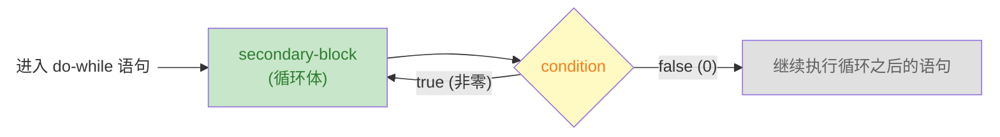

# Modern C 笔记：ch03-控制流

> 章节：第 3 章 · Everything Is About Control（控制流）  
> 日期：2026-07-25  
> 状态：☑ 已完成

---

## 📋 速览

C 语言通过六种控制结构来管理程序的执行路径。条件执行（`if`/`else`）根据表达式的真值从两条代码路径中二选一，C 的根基是"数值即真值"——零为假、非零为真，且所有标量类型（包括指针）都有真值。多路选择（`switch`）是级联 `if` 的替代方案，通过整型常量匹配跳转到对应 `case`，需注意 `break` 防止穿透。

三种迭代语句覆盖了不同场景：`for` 是域迭代的首选工具，初始化、条件、更新三合一；`while` 在迭代次数未知时更自然，先检查后执行；`do-while` 保证至少执行一次。`break` 和 `continue` 在循环内部提供额外的流程控制——前者终止整个循环，后者跳过本次迭代的剩余代码

---

## 📖 知识点


### 知识点 4：`do-while` 循环 ☑ 已完成


**是什么**

`do-while` 与 `while` 几乎是一样的，也是在不知道需要迭代多少次的前提下使用。但是，`do-while` 的循环体至少执行一次

**详细解释**

`do-while` 和 `while` 的差异在于控制表达式的检查时机不同

```c
do secondary-block while (condition); // 注意：这里的分号(;) 一定不能少，它是 do-while 语的结束标记
```

`do-while` 的执行顺序是：先执行 `secondary-block` 依赖块（通常是 `{...}` 块），再检查控制表达式(`condition`)。该表达式的值为 `true`，就回头继续执行；否则，退出循环



> [!TIP]
>
> `do-while` 保证 `secondary-block` 至少执行一次，即使最初的控制表达式的值为 `false`。

使用 `do-while` 的典型场景是"**至少要做一次**，然后根据结果决定要不要继续"

**代码示例**

《Modern C》 中也是用 Heron 近似求给定数的倒数来对比的

```c
// while 版本 — 先检查，可能 0 次
while (fabs(1.0 - a*x) >= ε) {
    x *= (2.0 - a * x);
}

// do-while 版本 — 先执行，至少 1 次
do {
    x *= (2.0 - a * x);
} while (fabs(1.0 - a*x) >= ε);
```

> 如果初始 `x` 刚好满足精度，`while` 直接结束，`do-while` 还是会计算一次。

**练习**

- [x] **练习 1**：while → do-while 转换 — 以下 `while` 循环每次迭代前都要先检查 `n > 0`。如果已知 `n` 至少为 1，改写为 `do-while` 会更自然。请改写：

  ```c
  size_t n = 10;
  while (n > 0) {
      printf("%zu\n", n);
      --n;
  }
  // do-while 版本
  size_t n = 10;
  do {
      printf("%zu\n", n);
      --n;
  } while (n >= 1);
  ```

- [x] **练习 2**：完整程序 — 用 `do-while` 循环实现输入校验：反复提示用户输入一个 1~100 之间的正整数，直到输入合法为止，然后打印该数字，保存到 `code/ch03/validate.c`

- [x] **练习 3**：完整程序 — 用 `do-while` 循环实现一个简易菜单：显示选项（1. 打招呼 2. 报时 3. 退出），根据用户选择执行对应操作，直到用户选择退出，保存到 `code/ch03/menu.c`

  ```c
  // validate.c 核心逻辑
  int n;
  do { scanf("%d", &n); } while (n < 1 || n > 100);
  
  // menu.c 核心逻辑
  int choice;
  do {
      scanf("%d", &choice);
      switch (choice) {
          case 1: puts("hello"); break;
          case 2: /* print current time */ break;
      }
  } while (choice != 3);
  ```

---

