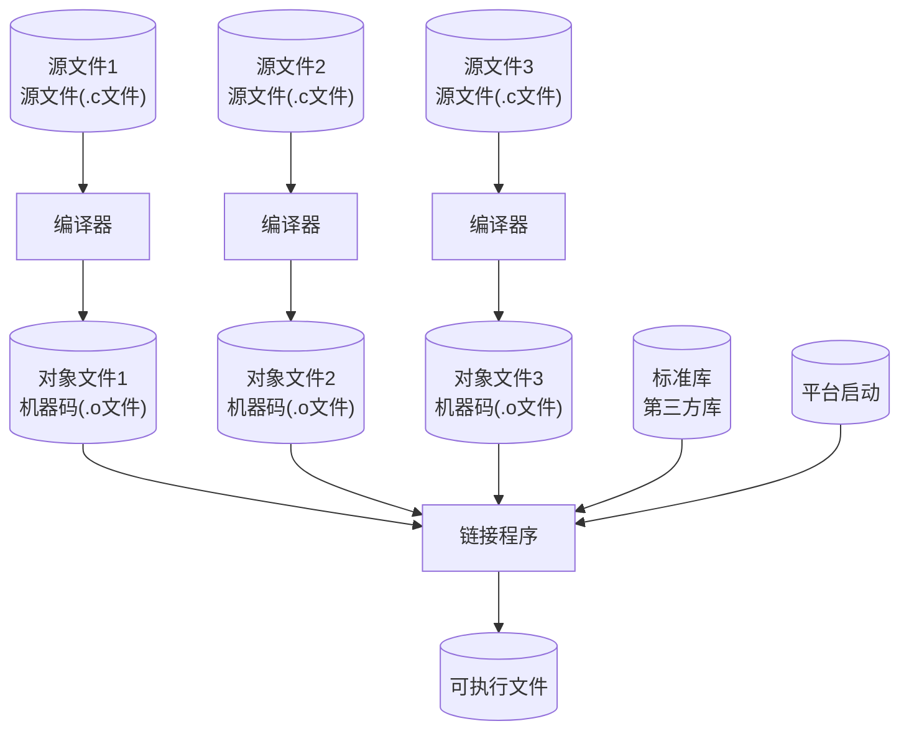

# 编译型语言

> week01 · C 语言全貌 · 知识点 2

> 状态：☑ 已完成

---

## 速览

C 是编译型语言，源代码经过预处理、编译、汇编、链接四个阶段生成可执行文件。编译器是程序员的朋友——它帮你检查语法错误、类型不匹配等问题。编译型语言的执行效率高于解释型语言。

---

## 是什么

编译型语言是指源代码在执行前需要通过**编译器**完整翻译为**目标平台**机器码的语言。C 语言的编译过程分为预处理、编译、汇编、链接四个阶段。相比解释型语言，编译型语言的执行效率更高，因为翻译工作在运行前已完成

C 编译器为所有不同机器的特定语言（通常称为**汇编语言**）提供了一个抽象级。换句话说，正确的 C 程序在不同的平台之间是可移植的

>  [!TIP]
>
>  **可移植**：无论在哪个平台运行，程序的行为应该相同。《Modern C》主要讲解的就是如何编写一个正确的 C 程序来确保可移植性

---

## 详细解释

**编译的四个阶段**：编译器编译 C 源码分为**四阶段**：

1. 预处理（`.c → .i`）：预处理器执行 C 源码中的所有预处理指令：展开 `#include` → 替换宏 → 条件编译 → `*.i`
    ```shell
    ➜ gcc -std=c23 -Wall  -Werror -E getting-started.c -o getting-started.i
    ```

2. 编译（`.i → .s`）：编译器接收预处理器的输出并将其转换为目标平台的汇编代码：语法分析 → 语义分析 → 生成汇编指令 → 优化 → `*.s`
    ```shell
    ➜ gcc -std=c23 -Wall  -Werror -S getting-started.c -o getting-started.s
    ```

3. 汇编（`.s → .o`）：汇编器接收编译器的输出并将其翻译为目标平台的二进制指令：汇编指令 → 目标代码 → `*.o`

    ```shell
    ➜ gcc -std=c23 -Wall  -Werror -c getting-started.c -o getting-started.o  
    ```

4. 链接（`.o + lib + start → 可执行文件`）：链接器将目标文件与库和启动代码进行链接从而生成可执行文件
    ```shell
    ➜ gcc -std=c23 -Wall  -Werror getting-started.o -o getting-started 
    ```

下表总结了编译器四个阶段主要执行的动作以及需要使用编译器选项

| 编译阶段   | 描述                                                        | 编译选项 |
| ---------- | ----------------------------------------------------------- | -------- |
| 预处理阶段 | 展开 `#include` → 替换宏 → 条件编译 → `*.i`(C代码)          | `-E`     |
| 编译阶段   | 语法分析 → 语义分析 → 生成汇编指令 → 优化 → `*.s`(汇编代码) | `-S`     |
| 汇编阶段   | 汇编指令 → 目标代码 → `*.o`(二进制代码)                     | `-c`     |
| 链接阶段   | 目标代码 + lib + start → 可执行文件                         |          |

下图演示了整个 GCC 编译器完整的编译流程




日常我们使用一条命令完成 C 源码的编译和链接：

```bash
➜ gcc -std=c23 -Wall  -Werror -o getting-started getting-started.c
```

> [!WARNING]
>
> 注意：当 C 源码被编译器翻译为目标平台的机器指令后，可移植性立即丢失了。因为，不同平台的机器指令往往是以不同的

---

## 代码示例

<!-- 这个知识点不涉及代码 -->

