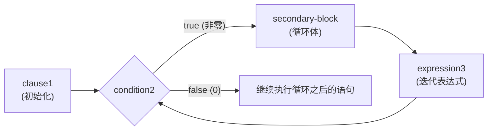

# for 循环

> week01 · C 语言全貌 · 知识点 9

> 状态：☑ 已完成

---

## 速览

`for` 语句是 C 的域迭代工具，让循环变量在某个范围内变化。语法 `for (clause1; condition2; expression3) secondary-block`，四个部分各司其职：初始化（一次）、条件检查（每次迭代前）、更新（每次迭代后）、循环体。适合循环次数明确的场景。

---

## 是什么

**for 循环**是一种迭代语句，用于在已知循环次数的场景下重复执行代码块。它将初始化、条件判断和迭代更新集中在一行，适合控制循环变量在某个范围内变化。

---

## 详细解释

`for` 循环我们已经在 `getting-started.c` 上见过了，但是只是简单介绍了一下。现在补齐 `for` 语句

```c
for (clause1; condition2; expression3) secondary-block
```

这四个部分各司其职：

| 部分    | 执行时机               | 做什么                               |
|---------|------------------------|--------------------------------------|
| `clause1`   | 循环开始前，只执行一次 | 设定起点——**通常是声明并初始化循环变量** |
| `condition2`   | 每次迭代前检查         | 值为真就继续，为假就退出             |
| `expression3` | 每次迭代结束后执行     | 更新循环变量，让它向终点靠近         |
| `secondary-block` | 条件为真时执行         | 循环体，真正重复干活的代码。通常是 `{...}` 程序块 |

下图描述了 `for` 循环的执行过程


> [!TIP]
> 1. `clause1` 应该始终是循环遍历的定义（不是赋值），这样循环遍历的作用域就被限制在 `for` 内部使用
> 2. `for` 的依赖块应该始终使用 `{...}` 包围。`for` 相比于 `if` 更复杂，使用括号可以区分循环体边界

《Modern C》中给出了 $3$ 个 `for` 语句示例用法，每个都值得细看。这三个示例中都使用了 `size_t` 类型。`size_t` 是 C 语言中的一种语义类型，它表示了数量和大小的概念，意味着这种类型永远不会为负数

1. **倒着数**

    ```c
    for (size_t i = 10; i; --i) {
        something(i);
    }
    ```
    
    循环变量 `i` 从 $10$ 开始，条件是 `i`（数值即真值：`i` 非零时就是真，`i` 为零时就是假）。显然，当 `i` 为 $0$ 时，循环结束。这段代码从 $10$ 遍历到 $1$，共遍历 $10$ 次 

2. **两个循环变量**

    ```c
    for (size_t i = 0, stop = upper_bound(); i < stop; ++i) {
        something(i);
    }
    ```

    `clause1` 中声明两个循环变量。`stop` 只通过 `upper_bound()` 函数（耗时函数）计算一次，如果将 `upper_bound()` 写在条件中（`i < upper_bound()`），每次迭代都会重新调用，非常浪费性能

3. **看起来是死循环但不是**

    ```c
    
    for (size_t i = 9; i <= 9; --i) {
        something(i);
    }
    ```

    条件 `i <= 9` 看起来始终为真值，但其实不是。因为 `size_t` 是无符号的，当 `i = 0` 时，`--i` 不会变成 $-1$ ，而是回绕到 `SIZE_MAX`（取决于平台，但一定非常大）。此时，条件 `SIZE_MAX < 9` 一定为假，循环结束。所以，这段代码从 $9$ 遍历到 $0$，共遍历 $10$ 次

三个例子中的循环变量都叫 `i`，但它们的作用域各自独立、互不重叠：变量只在自己的 `for` 语句内可见

## 代码示例

`square.c` — 基本用法：接收一个命令行参数 `number`，循环打印 1 到 `number` 的平方表

```c
#include <stdio.h>
#include <stdlib.h>

int main(int argc, char* argv[argc + 1]) {
    if (argc != 2) {
        fprintf(stderr, "Usage: %s <number>\n", argv[0]);
        return EXIT_FAILURE;
    }

    unsigned long number = strtoul(argv[1], nullptr, 0);

    for (size_t i = 1; i <= number; ++i) {
        printf("%10zu%10zu\n", i, i * i);
    }

    return EXIT_SUCCESS;
}
```

`square2.c` — 两个循环变量 + 迭代优化：`square` 跟踪当前平方值，`odd` 是连续奇数，利用 $n^2 = (n-1)^2 + (2n-1)$ 的数学性质，每次只做加法不算乘法，性能更好

```c
#include <stdio.h>
#include <stdlib.h>

int main(int argc, char* argv[argc + 1]) {
    if (argc != 2) {
        fprintf(stderr, "Usage: %s <number>\n", argv[0]);
        return EXIT_FAILURE;
    }

    unsigned long number = strtoul(argv[1], nullptr, 0);
	
    // 计算加法要比计算乘法更快
    for (size_t i = 1, square = 1, odd = 1;
         i <= number;
         ++i, odd += 2, square += odd) {
        printf("%10zu%10zu\n", i, square);
    }

    return EXIT_SUCCESS;
}
```

> [!TIP]
>
> `square2.c` 的 `clause1` 中声明了三个变量，`expression3` 中同时更新它们——这就是笔记中"两个循环变量"模式的实际应用

`primes.c` — 统计 $N$ 以内素数的个数（暴力解法：从第一个素数 $2$ 开始遍历直到 $N$）

```c
#include <stdio.h>
#include <stdlib.h>

int main(int argc, char* argv[argc + 1]) {
    if (argc != 2) {
        fprintf(stderr, "Usage: %s <number>\n", argv[0]);
        return EXIT_FAILURE;
    }

    size_t number = strtoull(argv[1], nullptr, 0);

    size_t count = 0;

    // 从 1 开始遍历到 number
    for (size_t target = 2; target <= number; ++target) {
        bool flag = true;
        // 对于每个 number
        for (size_t factor = 2;  factor * factor <= target; ++factor) {
            if (!(target % factor)) {
                flag = false;
                break;
            }
        }
        if (flag) {
            ++count;
        }
    }

    printf("There are a total of %zu prime numbers in %zu\n", count, number);
    return EXIT_SUCCESS;
}
```

`primes2.c` —  统计 $N$ 以内素数的个数（优化一：除了 $2$ 以外，所有素数都是奇数；奇数的因子不可能是偶数）

```c
#include <stdio.h>
#include <stdlib.h>

int main(int argc, char* argv[argc + 1]) {
    if (argc != 2) {
        fprintf(stderr, "Usage: %s <number>\n", argv[0]);
        return EXIT_FAILURE;
    }

    size_t number = strtoull(argv[1], nullptr, 0);

    size_t count = 1;

    // 从 1 开始遍历到 number
    for (size_t target = 3; target <= number; target = target + 2) {
        bool flag = true;
        // 对于每个 number
        for (size_t factor = 3;  factor * factor <= target; factor = factor + 2) {
            if (!(target % factor)) {
                flag = false;
                break;
            }
        }
        if (flag) {
            ++count;
        }
    }

    printf("There are a total of %zu prime numbers in %zu\n", count, number);
    return EXIT_SUCCESS;
}
```

`primes3.c` — 统计 $N$ 以内素数的个数（优化2：利用孪生素数猜想生成可选素数序列）

```c
#include <stdio.h>
#include <stdlib.h>

int main(int argc, char* argv[argc + 1]) {
    if (argc != 2) {
        fprintf(stderr, "Usage: %s <number>\n", argv[0]);
        return EXIT_FAILURE;
    }

    size_t number = strtoull(argv[1], nullptr, 0);

    size_t count = 3;  // 2 3 5 是已知的素数

    // 从 1 开始遍历到 number
    for (size_t target = 7, step = 4; target <= number; target = target + step, step = 6 - step) {
        // 对于大于 5 的数，5 的倍数一定不是素数
        if (!(target % 5)) {
            continue;
        }
        bool flag = true;
        // 对于每个 number
        for (size_t factor = 3;  factor * factor <= target; factor = factor + 2) {
            if (!(target % factor)) {
                flag = false;
                break;
            }
        }
        if (flag) {
            ++count;
        }
    }

    printf("There are a total of %zu prime numbers in %zu\n", count, number);
    return EXIT_SUCCESS;
}
```

> [!TIP]
>
> 孪生素数猜想：除了 $2$ 之外，存在无穷多个素数 $p$，使得 $p+2$ 也是素数。根据这个猜想，从 $5$ 开始，相邻两个素数满足 $(6k-1, 6k+1)$

