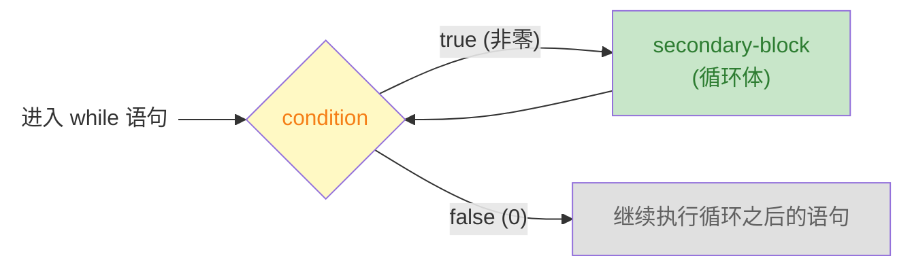

# while 循环

> week01 · C 语言全貌 · 知识点 10

> 状态：☑ 已完成

## 速览

`while` 是 C 的迭代语句，用于循环次数不确定的场景。只有条件表达式和循环体，循环变量的初始化和更新由程序员负责。与 `for` 的区别：`for` 适合域迭代（次数明确），`while` 适合条件驱动（次数不确定）。`while` 可能一次都不执行。

---

## 是什么

**while 循环**是一种迭代语句，用于在未知循环次数的场景下重复执行代码块。它先检查条件，条件为真时执行循环体，可能一次都不执行。

---

## 详细解释

`while` 循环是可以看作 `for` 循环的简化版本；只需要一个控制表达式(`condition`) 和 `while` 语句的依赖块

```c
while (condition) secondary-block
```

`while` 语句的执行流程非常简单：先检查控制表达式，条件为 `true` 就执行 `secondary-block` 依赖块（和 `for` 一样，应该是 `{...}` 块），然后再次检查条件，直到条件为 `false` 为止。下图演示了 `while` 语句的执行流



`while` 语句与 `for` 语句的差异就是 `for` 语句把循环变量、控制表达式、更新循环变量三个职责打包在一起。然而，`while` 只负责检查控制表达式的值，循环变量的初始化和更新操作交给程序员自行控制

```c
// for 版本 — 三个职责打包
for (size_t i = 0; i < 10; ++i) { ... }

{
    // while 版本 — 拆开，各管各的
    size_t i = 0;          // 初始化：你自己写
    while (i < 10) {       // 条件：while 管
        ...
        ++i;               // 更新：你自己写
    }
} 
```

> [!TIP]
>
> 上述的示例代码中的 `for` 循环和 `while` 循环是等价的。因为，我们使用 `{...}` 将 `while` 循环需要的循环变量打包在一起了

所以，什么时候使用 `while` 循环而不是 `for` 循环呢？

+ **循环次数明确**、遍历一个范围 → `for`（域迭代）
+ **循环次数不确定**、靠某个条件控制 → `while`

《Modern C》 中使用了 Heron 近似求倒数来说明什么时候用 `while` 语句

```c
double const a = 34.0;
double x = 0.5;
while (fabs(1.0 - a*x) >= error) {    // 只要还没达到精度
	x *= (2.0 - a*x);              // 就继续逼近
}
```

这里要迭代多少次才能达到精度是不知道的，显然无法使用 `for` 循环，因为没有明确的迭代范围。最好的方法就是使用 `while` 一直迭代，直到满足要求为止

> [!WARNING]
>
> 注意：`while` 可能一次都不会执行。如果条件一开始就是 `false`，依赖块直接被跳过了

## 代码示例

`heron.c` — 实现了《Modern C》 中演示例子：计算 $\frac{1}{x}$ 的近似值

```c
#include <stdio.h>
#include <stdlib.h>
#include <math.h>

int main(int argc, char* argv[argc + 1]) {
    if (argc != 3) {
        fprintf(stderr, "Usage: %s <x> <error>\n", argv[0]);
        return EXIT_FAILURE;
    }
    double x = strtod(argv[1], nullptr);
    if (x == 0.0) {
        fprintf(stderr, "x can not be zero.\n");
        return EXIT_FAILURE;
    }
    double error = strtod(argv[2], nullptr);

    // 猜测初始值
    double yn = fabs(x) > 1.0 ? 1 / x : x;

    // 终止条件 g(y) - 0 < error ==> 1/yn - x < error ==> 1 - x * yn < errr
    while (fabs(1 - x * yn) >= error) {
        yn *= (2 - yn * x);
    }

    printf("1 / %.2g = %.2g\n", x, yn);

    return EXIT_SUCCESS;
}
```

> Heron 近似（本质上就是牛顿迭代法）的数学原理
>
> 牛顿迭代法是计算方程 $f(x) = 0$ 解的数值方法。核心思想就是猜测一个初始解 $x_{0}$ 并在 $(x_{0}, f(x_{0}))$ 处做切线，沿着切线方向逼近零点
> $$
> f(x)\approx f(x_{0}) + f^{\prime}(x_{0})(x - x_{0}) = 0
> $$
> 解的迭代公式
> $$
> x_{n+1} = x_{n} - \frac{f(x_n)}{f^{\prime}(x_{n})}
> $$
> 现在的问题是何时停止迭代呢？牛顿迭代法的三种常用停止条件
>
> | 停止条件                     | 数学表达式                                        | 含义                                   |
> | ---------------------------- | ------------------------------------------------- | -------------------------------------- |
> | 函数值与目标值之间相差足够小 | $\vert f(x_{n}) - a \vert \lt \varepsilon$        | 解已经足够接近真正的零点               |
> | 相邻两次差值足够小           | $\vert x_{n+1} - x_{n} \vert \lt \varepsilon$     | 迭代已到达最优值，继续算也不会更准确了 |
> | 相对变化足够小               | $\frac{|x_{n+1} - x_n|}{|x_{n+1}|} < \varepsilon$ | 跟自身大小比，变化已经微不足道         |


现在我们需要计算 $f(x) = \frac{1}{x}$ 的值。令 $f(y) = \frac{1}{y}$ 其中 $y = \frac{1}{x}$，这样我们就可以构建递方程 $g(y)=\frac{1}{y} - x = 0$。这样可以得到递推公式
$$
\begin{aligned}
y_{n+1} &= y_{n} - \frac{\frac{1}{y}-x}{-\frac{1}{y_{n}^2}}\\
y_{n+1} &=y_{n} + y_{n} - y_{n}^{2}x\\
y_{n+1} &=y_{n}(2-y_{n}x)
\end{aligned}
$$

