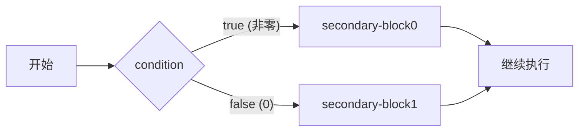

# 条件执行

> week01 · C 语言全貌 · 知识点 8

> 状态：☑ 已完成

---

## 速览

`if` 语句根据条件表达式的真假选择执行路径。条件为真（非零）执行 `secondary-block0`，否则执行 `secondary-block1`。`if` 也可以没有 `else` 分支。级联 `if-else if-else` 可处理多种条件，但过长时应考虑 `switch`。

---

## 是什么

条件执行由 `if` 关键字引导。`if` 判断一个条件(`condition`)是真还是假，从两个可选代码路径中选择一个执行。也就是说，**`if` 语句让程序根据不同情况走不同的路**

---

## 详细解释

`if` 语句的完整形式如下(完整形式的 `if` 语句也称为选择语句：从两条代码路径中选择一条来执行)

```c
if (condition) secondary-block0 else secondary-block1
```

`if` 语句执行时，先计算 **控制表达式**（`condition`）的值；如果该表达式的值是 `true(1)`，则执行 `secondary-block0` 依赖块；否则，执行 `secondary-block1` 依赖块。这两个依赖块都应该是 `{...}` 包围的程序块



>  [!TIP]
>
>  `else` 部分对于 `if` 语句而言是可选的。因此，`if` 语句最简单的形式是
>
>  ```c
>  if (condition) secondary-block
>  ```
>
>  此时，`if` 语句的语义是根据控制表达式（`condition`）是真还是假，决定要不要执行这代码

**逻辑值**：虽然从 C23 开始有了 `bool` 类型，但 C 的根基还是 **数值即真值**(任何标量类型都有真值，指针也是标量)；遵循两条转换规则

| 值   | 逻辑含义      | 示例                                                         |
| ---- | ------------- | ------------------------------------------------------------ |
| 零值 | 假（`false`） | `int` `size_t` `double` 的 `0` 或 `0.0`；空指针 `NULL/nullptr` |
| 非零 | 真（`true`）  | `int` `size_t` `double` 的任何非零值; 非空指针               |

因此，在代码中如果需要检查数值是否等于 $0$，可以直接测试数值，而不是使用 `==`(判断相等) 和 `!=`(判断不相等)运算符与 $0$ 进行比较

```c
if (i != 0) { ... }  // i != 0 啰嗦
if (i) { ... }       // i 本身就可以作为条件 

if (i == 0) { ... }	// 啰嗦
if (!i) { ... }		// ! 表示取反，i 为 0 时 !i 的逻辑值是真
```

> **相等性判断**：C 使用 `==` 判断两个值是否相等；使用 `!=` 判断两个值是否不相等。注意：数学上，运算符 `=` 用于进行相等性比较；但是，在 C 中，它作为了赋值运算符使用；如果我们误用它们，编译器不一定报错
>

从 C23 标准起，C 提供了 `bool` 类型和它两个字面值 `true` 和 `false`；它们的使用规则与数值条件完全一致

```c
bool done = false;
if (done) { ... }	// 不要使用 if (done == true)
```

> [!TIP]
>
> 不要拿布尔值与 0 `false` `true` 进行比较，直接使用它本身即可
>
> + `if (b) { ... }`
> + `if (!b) { ... }`
>
> 注意：如果你使用的编译器不支持 C23 标准，则需要 `#include <stdbool.h>`(C99标准引入，C23 标准废弃)

**嵌套的if语句**：C 标准对 `if` 语句的依赖块没有任何限制，它甚至可以是另一条 `if` 语句。例如，从三个数中找出其中的最大值，我们可能会写出下面的 `if` 语句

```c
if (i > j) {
    if (i > k) {
        max = i;
    } else {
        max = k;
    }
} else {
    if (j > k) {
        max = j;
    } else {
        max = k;
    }
}
```

`if` 语句的 `secondary-block` 只有一条语句时，不需要将其放在 `{ ... }` 中。

```c
if (i > j)
    if (i > k)
        max = i;
    else
        max = k;
else
    if (j > k)
        max = j;
    else
        max = k;
```

虽然，我们将每个 `else` 与它匹配 `if` 对齐排列，以提高可读性。但是，强烈建议始终保留花括号 `{...}` 这样可以避免 **悬空else** 问题。例如，`else` 的缩进暗示它与外层 `if` 匹配。但是，`else` 规则是就近匹配 `if` 

```c
if (y != 0)
    if (x != 0)
        result = x / y;
else	// ⬅ 整个 else 的缩进暗示它应该与最外层的 if 匹配。但是，C 规则是就近匹配
    printf("Error: y is equal to 0\n");
```

始终使用 `{ ... }` 包围每一个 `secondary-block` 可以最大层度的避免悬空 `else` 问题

```c
if (y != 0) {
    if (x != 0)
        result = x / y;
} else {
    printf("Error: y is equal to 0\n");
}

```

**级联 if**：这不是新语句，仅仅是 `if` 语句的 `else` 依赖块正好是另一个 `if` 语句的嵌套而已

```c
if (n < 0) {
    printf("n is less than 0\n");
} else if (n == 0) {
    printf("n is equal to 0\n");
} else {
    printf("n is greater than 0\n");
}
```

---

## 代码示例

`broker.c` — 级联 `if` 的实际应用：根据股票交易额计算经纪人佣金，最低收费 39 美元

```c
/*  broker.c - 计算股票经纪人的佣金  */

#include <stdio.h>
#include <stdlib.h>

int main(int argc, char* argv[argc + 1]) {
    if (argc != 2) {
        fprintf(stderr, "Usage: %s <trade>\n", argv[0]);
        return EXIT_FAILURE;
    }
    // 获取交易金额：字符串转换为数值
    double trade = strtod(argv[1], nullptr);
    double commission = {0.0};

    if (trade < 2500.0) {
        commission = 30.0 + trade * 0.017;
    } else if (trade < 6250.0) {
        commission = 56.0 + trade * 0.0066;
    } else if (trade < 20000.0) {
        commission = 76.0 + trade * 0.0034;
    } else if (trade < 50000.0) {
        commission = 100.0 + trade * 0.0022;
    } else if (trade < 500000.0) {
        commission = 155.0 + trade * 0.0011;
    } else {
        commission = 255.0 + trade * 0.0009;
    }

    if (commission < 39.0) {
        commission = 39.0;
    }

    printf("Trade is $%.2f commision is $%.2f\n", trade, commission);

    return EXIT_SUCCESS;
}
```

`three_max.c` — 嵌套 `if`：从三个数中找出最大值，演示 `if` 的依赖块可以是另一条 `if`

```c
/* three_max.c - 嵌套 if 求三数最大值 */

#include <stdio.h>
#include <stdlib.h>

int main(int argc, char* argv[argc + 1]) {
    if (argc != 4) {
        fprintf(stderr, "Usage: %s <i> <j> <k>\n", argv[0]);
        return EXIT_FAILURE;
    }

    int i = atoi(argv[1]);
    int j = atoi(argv[2]);
    int k = atoi(argv[3]);
    int max;

    if (i > j) {
        if (i > k) {
            max = i;
        } else {
            max = k;
        }
    } else {
        if (j > k) {
            max = j;
        } else {
            max = k;
        }
    }

    printf("max(%d, %d, %d) = %d\n", i, j, k, max);

    return EXIT_SUCCESS;
}
```

`dangling_else.c` — 演示悬空 `else` 问题：`else` 就近匹配 `if`，缩进会误导阅读者

```c
/* dangling_else.c - 悬空 else 演示 */

#include <stdio.h>
#include <stdlib.h>

int main(int argc, char* argv[argc + 1]) {
    if (argc != 3) {
        fprintf(stderr, "Usage: %s <x> <y>\n", argv[0]);
        return EXIT_FAILURE;
    }

    int x = atoi(argv[1]);
    int y = atoi(argv[2]);
    int result = 0;

    // ⚠ 错误写法：else 的缩进暗示匹配外层 if，实际匹配内层 if
    if (y != 0)
        if (x != 0)
            result = x / y;
    else    // ⬅ 匹配的是 if (x != 0)，不是 if (y != 0)
        printf("Error: y is equal to 0\n");

    // ✅ 正确写法：始终使用 {...} 避免歧义
    if (y != 0) {
        if (x != 0) {
            result = x / y;
        }
    } else {
        printf("Error: y is equal to 0\n");
    }

    printf("result = %d\n", result);

    return EXIT_SUCCESS;
}
```

> [!TIP]
>
> `broker.c` 演示级联 `if`，`three_max.c` 演示嵌套 `if`，`dangling_else.c` 演示悬空 `else` 陷阱——三种 `if` 的典型用法和注意事项

