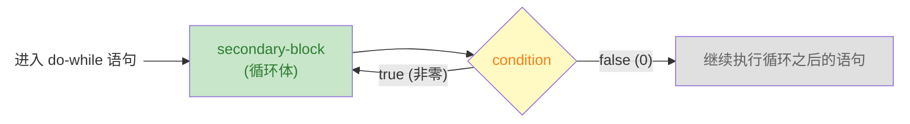

# do-while 循环

> week01 · C 语言全貌 · 知识点 11

> 状态：☑ 已完成

## 速览

`do-while` 与 `while` 几乎一样，区别在于先执行循环体再检查条件，保证循环体至少执行一次。典型场景是"至少要做一次，然后根据结果决定是否继续"。注意 `do-while` 末尾的分号不能省略。

---

## 是什么

`do-while` 与 `while` 几乎是一样的，也是在不知道需要迭代多少次的前提下使用。但是，`do-while` 的循环体至少执行一次

---

## 详细解释

`do-while` 和 `while` 的差异在于控制表达式的检查时机不同

```c
do secondary-block while (condition); // 注意：这里的分号(;) 一定不能少，它是 do-while 语的结束标记
```

`do-while` 的执行顺序是：先执行 `secondary-block` 依赖块（通常是 `{...}` 块），再检查控制表达式(`condition`)。该表达式的值为 `true`，就回头继续执行；否则，退出循环



> [!TIP]
>
> `do-while` 保证 `secondary-block` 至少执行一次，即使最初的控制表达式的值为 `false`。

使用 `do-while` 的典型场景是"**至少要做一次**，然后根据结果决定要不要继续"。《Modern C》中介绍依旧使用了 Heron 近似求倒数作为示例。不过，这个示例并不能有效说明 `do-while`。我们使用另一个例子：计算一个整数的位数

---

## 代码示例

`numdigit.c` — 计算整数的位数

```c
#include <stdio.h>
#include <stdlib.h>

int main(int argc, char* argv[argc + 1]) {
    if (argc != 2)  {
        fprintf(stderr, "Usage: %s <number>\n", argv[0]);
        return EXIT_FAILURE;
    }

    long number = strtol(argv[1], nullptr, 0);
    printf("%ld has ", number);
    if (number < 0) {
        number = -number;
    }

    size_t count = 0;

    do {
        number /= 10;
        ++count;
    }while (number != 0);

    printf("%zu digit(s)\n", count);

    return EXIT_SUCCESS;
}
```

