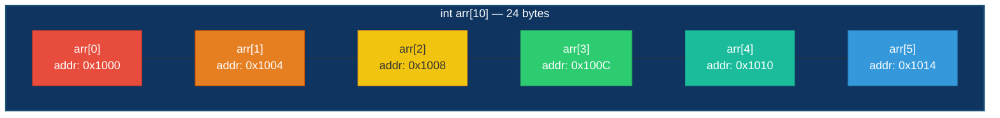
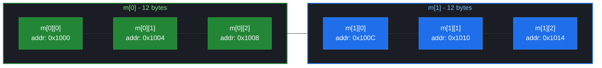

# 数组基础

> week02 · C 语言全貌 · 知识点 39

> 状态：☑ 已完成

---

## 速览

**数组**是将相同类型的对象组合成一个封装对象的聚合数据类型，元素在内存中连续存储，通过下标访问。数组不是指针，但会退化为指向首元素的指针。数组不能被赋值、不能被比较，只能通过 `[]`、`&`、`sizeof` 和衰减操作使用。

---

## 是什么

**数组**是将相同类型的对象组合成一个封装对象的聚合数据类型。数组和指针在 C 语言中是密切相关的；原因在于，数组在某些时候会退化为指针。但是，请注意：**数组不是指针**

---

## 详细解释

### 数组声明

数组是含有多个数据项的数据结构，每个数据项具有相同的数据类型，这些数据项称为**元素**。这些元素相邻的存储在一片连续地内存空间中，可以根据元素在数组中所处的位置把它们一个个地选出

数组变量也需要先声明才能使用，声明数组的方式和声明普通变量类似，只需要在标识符后面方式 `[N]` 即可。例如，

```c
int a[6];
```

`a` 是 `6` 个 `int` 类型对象的数组。下图演示数组 `a` 的内存布局，注意观察地址：**地址是连续的**



> [!WARNING]
>
> 注意：**数组的长度必须是 ICE**。虽然，从 C99 起允许我们使用**变长数组**(即，数组长度在运行时确定；这是与普通数组的区别)；但是，变长数组在随后的几个标准中都有不同程度的修改；不建议使用变长数组。此外，变长数组还存在两个限制
>
> + 只能有默认初始化器：不能提供初始化器对变长数组进行初始化，因为长度不确定编译器无法确保初始化器中元素的个数小于或等于数组的长度
> + 不能在函数外部声明：全局变量在程序运行前初始化，然而变长数组的长度在程序运行时才确定
>
> 在声明数组时，数组的长度必须是正整数；这意味着数组的最小长度是 $1$。例如，下面的声明属于是荒谬的
>
> ```c
> int a[-1];  // 荒谬的
> int b[0];	// 无意义
> ```

C 语言对数组元素的类型没有任何限制，甚至可以是另一个数组；从而形成**嵌套数组**（也称为**多维数组**）。由于 `[]` 与左边绑定，所以多维数组的声明读起来有点困难。例如，

```c
int m[2][3]; 
int (n[2])[3];
```

`m` 和 `n` 都是 `2` 个 `int[3]` 类型对象的数组。这意味着我们必须从内向外读取嵌套数组声明来描述其结构。下图描述了嵌套输入的内存布局图



> [!TIP]
>
> 数组的核心规则：**数组元素顺序存储**

### 数组初始化

在 [初始化器](../../week01/05-类型系统/29-初始化器.md) 中我们已经介绍过数组对象的初始化了。这里再次强调一遍；在 C 语言中，像数组这一的聚合类型对象的初始化一定要使用 `{...}` 初始化器。如果需要初始化的元素比较少，采用**指定初始化器**（C99）更为合理

```c
int a[6] = {
    [0] = 9,
    [2] = 7,
    [4] = 5,
};

int m[2][3] = {
    [0] = {[2] = 7},
    [1] = {[1] = 5}
}
```

> [!TIP]
>
> 剩余未初始化的元素被编译自动初始化为元素类型的零值

### 数组运算

数组本质上也是一种对象。但是，**不存在数组类型的值**；因此，数组对象不能赋值也不能参与算术运算。能用在数组对象上的运算符有且只有四种

+ 取地址运算符 `&`：获取指向数组对象的指针

+ 下标运算符 `[i]`：获取数组的第 $i+1$ 个元素

+ `sizeof` 运算符：获取数组对象占用的字节数

+ 数组衰减运算：数组退化为指向首元素的指针

    > [!TIP]
    >
    > 大部分情况下，数组参与运算时会退化指向首元素的指针；这意味着 **数组在条件表达式中求值为 `true`**

关于取地址运算符和衰减运算符留在 [数组与指针](43-数组与指针.md) 中介绍。为了存取特定的数组元素，可以使用下标运算符`[i]`获取数组的第 `i + 1` 个元素；也就是说，`a[i]` 表示的就是数组中第 `i + 1` 个元素（即，对象）；任何需要对象出现的地方都可以替换为 `a[i]`

```c
a[0] = 1; 				// 给第 1 个元素赋值
printf("%d\n", a[5]);	// 输出第 6 个元素
++a[i];					// 第 i = 1 个元素自增 1
```

这里的 `i` 也称为数组的索引，可以是任何整数类型的表达式。请注意，最小索引是 $0$，最大索引是 $N-1$，其中 $N$

是数组的长度；**小于 $0$ 或大于 $N-1$ 的索引都是越界的索引，用越界的索引访问数组元素是未定义行为**

> [!WARNING]
>
> 长度为 $N$ 的数组的索引是从 $0$ 开始到 $N-1$ 结束；可以将索引看作是数组元素与首元素的距离。C 语言不检查数组索引是否越界；所以在使用数组索引时一定要小心。例如，下面的代码片段使用了越界索引，可能会带来死循环风险
>
> ```c
> int a[10];
> for (int i = 1; i <= 10; i++) {
> 	a[i] = 0; 
> }
> ```
>
> 当变量 `i` 的值变为 $10$ 时，程序将数值 $0$ 存储在 `a[10]` 中。但是 `a[10]` 这个元素并不存在，因此在元素 `a[9]` 后数值 $0$ 立刻进入内存。如果内存中变量 `i` 放置在 `a[9]` 的后边（这是有可能的），那么变量 `i` 将被重置为 $0$，进而导致循环重新开始。

`sizeof` 运算符的唯一用途就是计算对象占用的字节数。因此，假设标识符 `a` 是一个长度为 $N$ 的 `int` 类型数组；`sizeof(a)` 返回的值就是 $N \times \text{sizeof(int)}$。当我们不知道数组的长度时，就可以通过这个关系计算出数组长度
$$
\text{length} = \frac{\text{sizeof\ A}}{\text{sizeof\ A[0]}}
$$
一般情况下，我们可以将其定义为一个函数式宏，方便后续使用

```c
#define SIZE(arr) (sizeof(arr) / sizeof((arr)[0]))
```

>  [!WARNING]
>
> 注意：宏 `SIZE` 的参数必须是一个数组对象。

---

## 代码示例

`reverse.c` — 数组反向：从标准输入中读取 $10$ 个整数存入数组中，然后将数组元素反向并输出

```c
/* reverse.c - 数组反向 */
#include <stdio.h>
#include <stdlib.h>

constexpr size_t size = 10;

int main(void) {

    int array[size] = {};

    printf("请输入 %zu 个整数: ", size);

    for (size_t i = 0; i < size; ++i) {
        scanf("%d", &array[i]);
    }

    for (size_t i = 0; i < size / 2; ++i) {
        array[i] += array[size - i - 1];
        array[size - i - 1] = array[i] - array[size - i - 1];
        array[i] = array[i] - array[size - i - 1];
    }

    printf("反向结果:");
    for (size_t i = 0; i < size; ++i) {
        printf(" %d", array[i]);
    }
    puts("");

    return EXIT_SUCCESS;
}
```

`interest.c` — 计算利息：输出一个表格，在几年时间内 $100$ 美元投资在不同利率下的价值

```c
/* interest.c - 计算投资利息（单利） */

#include <stdio.h>
#include <stdlib.h>

#define SIZE(array) (sizeof(array) / sizeof((array)[0]))
#define INITIAL_BALANCE 100.0

int main(void) {

    double value[5] = {};

    double rate = 0.0; // 利率
    int year = 0; // 投资年数

    printf("请输入利率（%%）: ");
    scanf("%lf", &rate);
    printf("请输入投资年数: ");
    scanf("%d", &year);

    printf("\nYears");
    for (size_t i = 0; i < SIZE(value); ++i) {
        printf("%6.0f%%", rate + i);
        value[i] = INITIAL_BALANCE;
    }
    puts("");

    for (int y = 1; y <= year; ++y) {
        printf("%3d  ", y);
        for (size_t i = 0; i < SIZE(value); ++i) {
            value[i] += (rate + 1) / 100.0 * value[i];
            printf("%7.2f", value[i]);
        }
        puts("");
    }

    return EXIT_SUCCESS;

}
```

