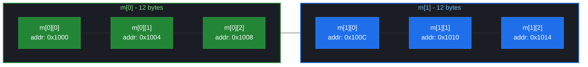

# 多维数组

> week02 · C 语言全貌 · 知识点 40

> 状态：☐ 学习中 / ☐ 已完成

---

## 速览

多维数组在内存中按行存储，可看作数组的数组

---

## 是什么

多维数组是数组的元素仍然是数组，形成嵌套结构；将多维数组称为 **嵌套数组** 更为合理。C 语言中 `[]` 与左边绑定，声明需要从内向外阅读。

---

## 详细解释

多维数组本质上是数组的数组，在 [数组基础](39-数组基础.md) 中我们已经介绍过如何声明它

```c
double C[M][N];        // M 行 N 列
double (D[M])[N];      // 等价声明
```

这里两个标识符 `C` 和 `D` 都是 `M` 个 `double[N]` 类型对象的数组。因此，需要从内向外阅读多维数组的声明。例如

```c
int m[2][3]; // m 是 2 个 int[3] 类型的数组 → 2 行，每行 3 个 int
```

`m` 是 `2` 个 `int[3]` 类型元素的数组；这种由两个维度数组在数学上称为矩阵，即 $2$ 行 $3$ 列的矩阵（注意：这只是帮助我们理解数组，不要认为数组就是矩阵）。永远谨记：**C 中的数组元素是顺序存储**；下图再次展示了数组 `m` 的内存布局



访问嵌套数组时，`m[0]` 获取是第一个 `int[3]` 子数组；`m[1]` 获取的是第二个 `int[3]` 子数组。想要获取嵌套数组中的元素，需要两个索引；例如，`m[0][1]` 获取的是第一个 `int[3]` 子数组中的第二个元素

---

## 代码示例

`deal.c` — 程序负责发一副标准纸牌

```c

```
