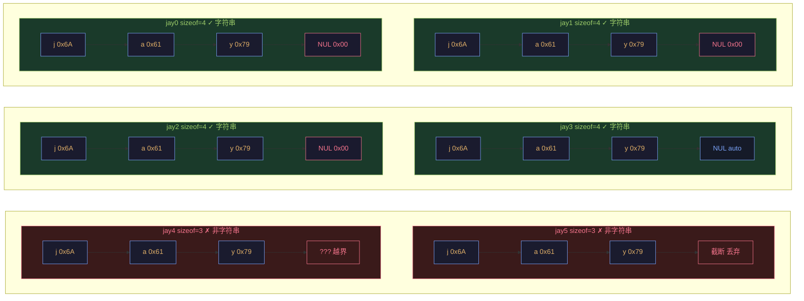

# 字符串基础

> week02 · C 语言全貌 · 知识点 41

> 状态：☑ 已完成

---

## 速览

**字符串**是以 `\0`（空字符）结尾的 `char` 数组。字符串字面量如 `"hello"` 自动包含结尾的 `\0`，因此长度为 6。字符串不能被赋值、不能参与算术运算，操作字符串需要使用 `<string.h>` 中的函数。

---

## 是什么

在 C 语言中，字符串本质上就是字符数组（元素类型为 `char`）。但是，请注意：C 标准要求字符数组以字符 `'\0'`（空字符） 结束

---

## 详细解释

在 C 语言中，字符数组很特殊；与其他数组相比，它甚至有字面量。在 [字符和字符串字面量](../../week01/05-类型系统/27-字符和字符串字面量.md) 中我们介绍了字符串的字面量，并且强调了字符串字面量也是由 `'\0'` 字符作为结尾的

> [!TIP]
>
> 在 C 语言中，如果字符数组中包含 `'\0'` 则该字符数组就字符串；这是字符数组与字符串的关键区别。换句话说，不包含 `'\0'`（空字符）的字符数组就只是普通的数组

也就是说，像 `"hello"` 这样的字符串总是比可看到的要多一个元素，其中包含值 `0`，所以这个数组的长度为 $6$。

> [!WARNING]
>
> 字符串的本质是数组；也就是说，字符串也不能进行赋值和算术运算

使用字符串字面量可以给字符串初始化（本质上就是字符数组的初始化）。下面几个字符串初始化方法都是等价的

```c
char jay0[] = "jay";              // ✓ 推荐
char jay1[] = { "jay" };          // ✓ 等价
char jay2[] = { 'j', 'a', 'y', 0, };  // ✓ 等价
char jay3[4] = { 'j', 'a', 'y', };    // ✓ 等价（自动补 0）
```

无论使用哪种初始化方法，都必须保证 `char[]` 类型的对象中包含字符 `'\0'`。例如，下面几个初始化方式就只是的初始化了一个普通的字符数组

```c
char jay4[3] = { 'j', 'a', 'y', };  // ✗ 不是字符串（没有 '\0'）
char jay5[3] = "jay";                // ✗ 不是字符串（截断了）
```

下图演示了这 $6$ 个字符数组内存布局



字符串的基本类型是 `char`，它是一种窄整数类型，用于编码 **基本字符集**

> [!TIP]
>
> 基本字符集包含了 C 语言中用于编码的所有字符，包括
>
> + 拉丁字母
> + 阿拉伯数字
> + 标点符号
>
> 其他特殊的字符，以及来自完全不同的书写系统的字符一般是不包含的

现在绝大多数平台都使用美国标准信息交换码（ASCII）来对 `char` 类型的字符进行编码。只要置于基本字符集中，我们就不必知道特定的编码是如何工作的：所有工作都是在 C 及其标准库中完成的，它们透明地使用这种编码

为了处理 `char` 数组和字符串，在头文件 `<string.h>` 附带的标准库中有一堆函数

+ 以 `mem` 开头的函数通常用于处理字符数组
+ 以 `str` 开头的函数通常用于处理字符串

---

## 代码示例

```c
// 最小可运行示例，只演示本知识点
```
