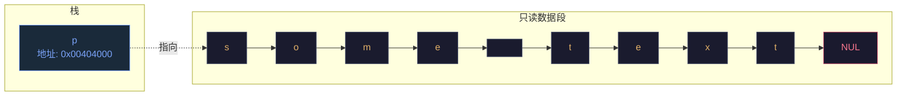
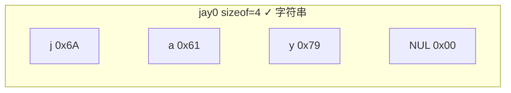

# 数组与指针

> week02 · C 语言全貌 · 知识点 43

> 状态：☑ 已完成

---

## 速览

**指针**是引用内存中对象的实体，是不透明对象，有有效、空、无效三种状态，必须初始化。**数组**不是指针，但会退化为指向首元素的指针（类型为 `T *const`）。数组不能赋值、不能比较、不能整体传递。

---

## 是什么

数组与指针的关系是 C 语言中最容易混淆的概念之一。教材《Modern C》中强调：数组不是指针，但数组在许多上下文中会"退化"为指向首元素的指针

---

## 详细解释

### 指针

指针这个概念已经在之前的学习中出现过了；例如，在 [命名常量](../../week01/05-类型系统/30-命名常量.md) 中的 `char const*cont` 来操作字符串字面量的引用；以及在 [字符串函数](42-字符串函数,d) 中将 `void*` 作为函数参数和返回类型

> [!TIP]
>
> 指针的主要特性就是：不直接持有我们感兴趣的信息，而是持有信息存储在内存中的地址；这就是指针

C 的指针语法总是有一个特殊的 `*` 号：

```c
char const*const p = "some text";
```



> [!TIP]
>
> 这里 `p` 不直接持有我们感兴趣的字符串 `"some text"`；而是持有字符串在内存中的地址。换句话说， `p` 的值不是 `"some text"` 的值，`p` 存的是一个地址，指向 `.rodata` 区的首字节。就像你存了朋友的门牌号，你家（`栈`）和朋友家（`堆/rodata`）是两个不同的地方

现在回头看 [字符串基础](41-字符串基础.md) 中 `jay0`；它是一个 `char[]` 类型的数组，直接持有了感兴趣的字符串 `"jay"`



目前，我们只需要知道指针的一些简单属性。指针的二进制表示完全取决于平台，与我们无关。**指针是不透明对象**；这意味着我们只能通过 C 语言允许的操作来处理指针。指针大部分特性将在第三周和第四周详细学习。目前，我们只需要了解初始化、赋值和计算

指针区别于其他变量的一个特殊属性是其状态：指针是 **有效的** **空的** 或 **无效的** 三种状态

| 状态   | 描述                                      | 示例                                |
| ------ | ----------------------------------------- | ----------------------------------- |
| 有效的 | 指针指向已知的对象                        | `char const*const p = "some text";` |
| 空的   | 指针的值是 `NULL` 或 `nullptr`（C23标准） | `int* p = nullptr;`                 |
| 无效的 | 指针指向未知的对象                        | `int *p = 0x00404000;`              |

+ `char const*const p = "some test";` 中的指针 `p` 一定是有效的，因为它指向了字符串字面量；并且，由于第二个 `const`，这种关系无法被切断
+ `int* p = nullptr;` 中的指针 `p` 是空的，因为它指向的是地址为 $0$ 的位置；操作系统不允许我们向零地址存放数据
+ `int* p = 0x00404000;` 中的指针 `p` 是无效的，因为它指向的是随意填写的地址；这个地址可能不属于当前程序

定义指针变量时一定要进行初始化，至少也要初始化为 `nullptr`；空指针就是数值 $0$；这意味着在逻辑表达式中，空指针的逻辑值是 `false`。如果指针变量没有进行初始化时，指针的值就是随机的（一般不是 `nullptr`），这样指针是无效的

>  [!WARNING] 
>
> 注意，使用 `if (p)` 这种方式进行测试是无法区分有效指针和无效指针。因此，指针真正的“坏”状态是未指定，因为这种状态是不可观察的。对无效指针进行解引用是未定义行为；通常会因段错误导致程序崩溃

### 数组与指针

数组与指针的关系非常密切，其原因在于**数组会退化为指向数组首元素的指针**；这种关系是无法改变的。也就是说，元素为 `T` 的数组退化为指针的类型是 `T *const`。显然，我们有以下结论

+ 数组的逻辑值一定是 `true`，因为它退化为的指针一定是有效的
+ 数组不能赋值：`arr1 = arr2` 相当于去改变 `arr1` 的指向，C 语言不允许的
+ 数组不能比较：`if (arr1 == arr2)` 这种比较没有意义，结果一定是 `false`；两个不同的数组对象的首元素一定存储在不同的地方
+ 数组不能作为函数参数整体传递，因为它会退化为指针

当我们使用取地址运算符 `&` 获取一共数组对象的地址时，其值虽然依旧是首元素的地址，但是其类型不是 `T*` 而是 `T (*) [N]` 表示指向长度为 `N` 元素类型为 `T` 的指针

```c
int a[5] = {1, 2, 3, 4, 5};
int* p = a;  //  数组 a 退化为 int *const 类型的指针，然后复制给指针 p
int (*pa)[5] = &a; // pa 指向长度为 5 元素为 int 类型的数组
```

---

## 代码示例

`array-pointer.c` — 演示数组与指针的关系

```c
/* array-pointer.c - 数组与指针的关系 */
#include <stdio.h>

int main(void) {
    int arr[5] = {10, 20, 30, 40, 50};
    
    // 1. 数组退化为指针
    int *p = arr;  // arr 退化为 &arr[0]
    printf("arr 地址: %p\n", (void*)arr);
    printf("p 的值:  %p\n", (void*)p);
    printf("arr[2] = %d, *(p+2) = %d\n\n", arr[2], *(p+2));
    
    // 2. 取地址运算符
    printf("&arr 类型: int (*)[5]\n");
    printf("arr  和 &arr 值相同: %s\n\n", 
           (arr == (int*)&arr) ? "true" : "false");
    
    // 3. 指针状态演示
    int valid = 42;
    int *vp = &valid;     // 有效指针
    int *np = nullptr;    // 空指针
    
    printf("vp 为 %s\n", vp ? "true" : "false");
    printf("np 为 %s\n\n", np ? "true" : "false");
    
    // 4. 数组不能赋值
    // arr[0] = 100;  // ✓ 可以修改元素
    // arr = ...;     // ✗ 不能整体赋值
    
    printf("修改元素: arr[0] = %d\n", arr[0]);
    arr[0] = 100;
    printf("修改后:   arr[0] = %d\n", arr[0]);
    
    return 0;
}
```
