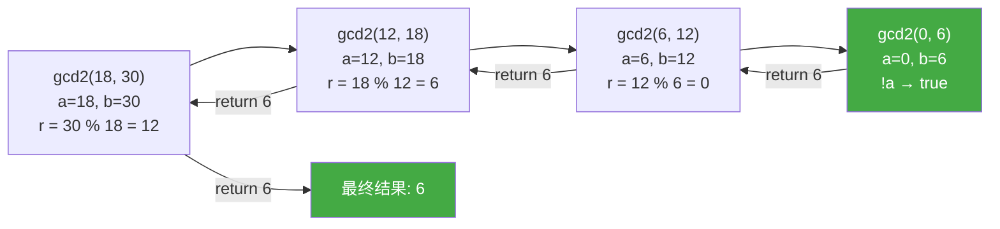

# 递归

> week02 · C 语言全貌 · 知识点 47

> 状态：☐ 学习中 / ☐ 已完成

---

## 速览

函数调用自身称为递归，必须有终止条件

---

## 是什么

**递归**是函数直接或间接调用自身的编程技术。递归建立在函数的**封装性**之上——每次调用都会创建新的局部变量副本，直到满足终止条件才停止

---

## 详细解释

### 函数的封装性

函数的一个重要特性是封装性：

+ 局部变量的可见性：局部变量只在函数内部可见，离开函数后就不可访问
+ 局部变量的生命周期：局部变量只在函数执行期间存在，函数返回后就被销毁
+ 标识符不冲突：不同函数中的同名变量互不干扰
+ 自动清理：离开函数后，所有"混乱"都会被自动清理

例如，函数 `func_a` 和 `func_b` 中都定义了变量 `x` 但是它们不在同一个作用域并且没有嵌套关系，因此它们是无关的。

```c
void func_a(void) {
    int x = 10;  // func_a 的局部变量 x
}
void func_b(void) {
    int x = 20;  // func_b 的局部变量 x，与 func_a 的 x 无关
}
```

### 递归调用的本质

更棒的是，每次调用函数时（即使是同一个函数），都会创建**全新的局部变量集合**（包括函数参数），并且这些变量会被**重新初始化**

```c
void recursive(int n) {
    int local = n;  // 每次调用都创建新的 local
    printf("n = %d, local = %d\n", n, local);
    if (n > 0) {
        recursive(n - 1);  // 递归调用，创建新的 local
    }
    // local 在每次返回时销毁
}
```

> [!TIP]
>
> 一个直接或间接调用自身的函数称为 **递归函数**。在递归调用链中，旧的调用仍然活跃，新调用也会创建独立的变量副本

递归函数对于理解 C 函数是至关重要的：它们演示和使用了函数调用模型的主要特性，并且只有使用这些特性时才具有完整的功能

### 示例1：递归版的 GCD

作为第一个例子，我们将研究使用 Euclid 算法来实现计算两个数的最大公约数（Greatest Common Divisor, GCD）：

```c
size_t gcd2(size_t a, size_t b) {
    assert(a <= b);		// 明确函数的所有前置条件
    if (!a) return b; 	// 递归函数首先要检查终止条件
    size_t r = b % a;
    return gcd2(r, a);
}
```

> [!TIP]
>
> 为了理解它是如何工作的，我们需要彻底地理解函数是如何工作的，以及我们如何将数学语句转换成算法。
>
> 给定两个整数 $a, b \gt 0$，$GCD$ 被定义为能够同时整除  $a$ 和 $b$ 的最大整数 $c$ 
> $$
> GCD(a, b) = \max\{c\in \N \vert c\vert a \and c \vert b \}
> $$
> 如果我们假设 $a \lt b$，很容得到两个递归公式
> $$
> GCD(a, b) = GCD(a, b - a)\\
> GCD(a,b) = GCD(a, b \% a)
> $$
> 也就是说，如果我们减去较小的整数或者用另一个数的模替换两者中较大的整数，GCD 不会改变

函数 `gcd2` 首先检查是否满足执行此函数的前置条件：第一个参数是否小于或等于第二个参数；这里通过 `<assert.h>` 头文件中的 `assert` 宏，如果函数是使用不满足该条件的参数调用的，那么将中止程序，并附有一条内容丰富的信息

>  [!WARNING]
>
> 前置条件：函数能够执行的前提；在定义函数时，应该使函数的所有前置条件都应该是明确的

对于递归函数而言是，检查完前置条件之后，应该立即检查递归的终止条件。`if (!a) return b;` 就是函数 `gcd2` 的终止条件

> [!WARNING]
>
> **递归函数如果缺失终止检查，则会导致无限递归**。函数会反复调用自身的新副本（新的栈帧），直到所有系统资源耗尽，程序崩溃。在拥有大量内存的现代系统中，这可能需要一些时间，在此期间系统将完全没有响应。你最好不要尝试




---

## 代码示例

```c
// 最小可运行示例，只演示本知识点
```
