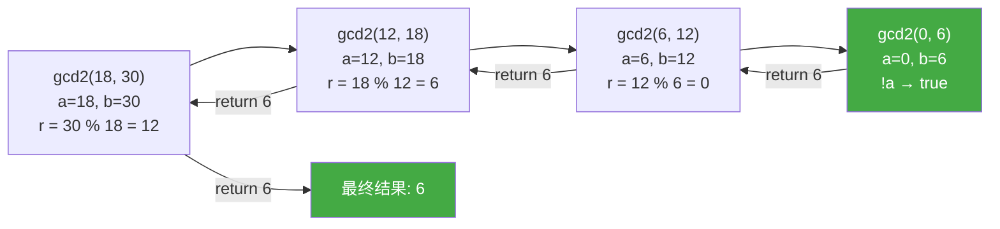
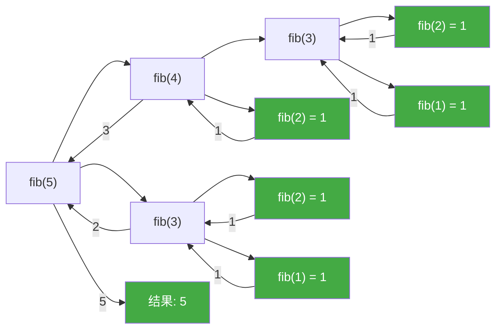
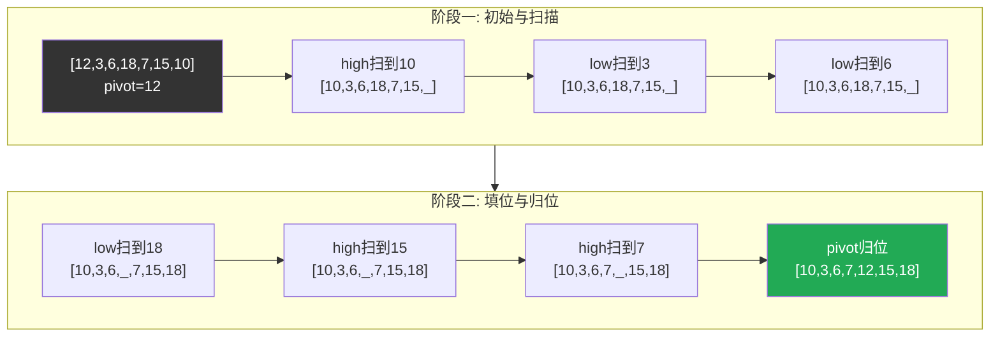

# 递归

> week02 · C 语言全貌 · 知识点 03

> 状态：☑ 已完成

---

## 速览

**递归**是函数直接或间接调用自身的编程技术，建立在函数的封装性之上。每次调用都会创建新的局部变量副本，直到满足终止条件才停止。递归必须有终止条件，否则会导致无限递归。

---

## 是什么

**递归**是函数直接或间接调用自身的编程技术。递归建立在函数的**封装性**之上——每次调用都会创建新的局部变量副本，直到满足终止条件才停止

---

## 详细解释

### 函数的封装性

函数的一个重要特性是封装性：

+ 局部变量的可见性：局部变量只在函数内部可见，离开函数后就不可访问
+ 局部变量的生命周期：局部变量只在函数执行期间存在，函数返回后就被销毁
+ 标识符不冲突：不同函数中的同名变量互不干扰
+ 自动清理：离开函数后，所有"混乱"都会被自动清理

例如，函数 `func_a` 和 `func_b` 中都定义了变量 `x` 但是它们不在同一个作用域并且没有嵌套关系，因此它们是无关的。

```c
void func_a(void) {
    int x = 10;  // func_a 的局部变量 x
}
void func_b(void) {
    int x = 20;  // func_b 的局部变量 x，与 func_a 的 x 无关
}
```

### 递归调用的本质

更棒的是，每次调用函数时（即使是同一个函数），都会创建**全新的局部变量集合**（包括函数参数），并且这些变量会被**重新初始化**

```c
void recursive(int n) {
    int local = n;  // 每次调用都创建新的 local
    printf("n = %d, local = %d\n", n, local);
    if (n > 0) {
        recursive(n - 1);  // 递归调用，创建新的 local
    }
    // local 在每次返回时销毁
}
```

> [!TIP]
>
> 一个直接或间接调用自身的函数称为 **递归函数**。在递归调用链中，旧的调用仍然活跃，新调用也会创建独立的变量副本

递归函数对于理解 C 函数是至关重要的：它们演示和使用了函数调用模型的主要特性，并且只有使用这些特性时才具有完整的功能

### 示例1：递归版的 GCD

作为第一个例子，我们将研究使用 Euclid 算法来实现计算两个数的最大公约数（Greatest Common Divisor, GCD）：

```c
size_t gcd2(size_t a, size_t b) {
    assert(a <= b);		// 明确函数的所有前置条件
    if (!a) return b; 	// 递归函数首先要检查终止条件
    size_t r = b % a;
    return gcd2(r, a);
}
```

> [!TIP]
>
> 为了理解它是如何工作的，我们需要彻底地理解函数是如何工作的，以及我们如何将数学语句转换成算法。
>
> 给定两个整数 $a, b \gt 0$，$GCD$ 被定义为能够同时整除  $a$ 和 $b$ 的最大整数 $c$ 
> $$
> GCD(a, b) = \max\{c\in \N \vert c\vert a \and c \vert b \}
> $$
> 如果我们假设 $a \lt b$，很容得到两个递归公式
> $$
> GCD(a, b) = GCD(a, b - a)\\
> GCD(a,b) = GCD(a, b \% a)
> $$
> 也就是说，如果我们减去较小的整数或者用另一个数的模替换两者中较大的整数，GCD 不会改变

函数 `gcd2` 首先检查是否满足执行此函数的前置条件：第一个参数是否小于或等于第二个参数；这里通过 `<assert.h>` 头文件中的 `assert` 宏，如果函数是使用不满足该条件的参数调用的，那么将中止程序，并附有一条内容丰富的信息

>  [!WARNING]
>
> 前置条件：函数能够执行的前提；在定义函数时，应该使函数的所有前置条件都应该是明确的

对于递归函数而言是，检查完前置条件之后，应该立即检查递归的终止条件。`if (!a) return b;` 就是函数 `gcd2` 的终止条件

> [!WARNING]
>
> **递归函数如果缺失终止检查，则会导致无限递归**。函数会反复调用自身的新副本（新的栈帧），直到所有系统资源耗尽，程序崩溃。在拥有大量内存的现代系统中，这可能需要一些时间，在此期间系统将完全没有响应。你最好不要尝试

下图演示了调用 `gcd(18, 30)` 的递归过程



对于每个递归调用，取模运算保证前提条件总能自动满足。对于初始调用，我们自己必须确保这一点。最好是使用另一个**包装**函数

```c
size_t gcd(size_t a, size_t b) {
    assert(a);
    assert(b);
    if (a < b) {
        return gcd2(a, b);
    } else {
        return gcd2(b, a);
    }
}
```

> [!TIP]
>
> 递归函数的前置条件可以使用包装函数进行检查，这样就避免了在每次递归调用时都要检查前提条件：`assert` 宏可以在最终的产品对象文件中禁用

### 示例2：递归版的斐波拉契数列

下面我们来看一个递归版本的整数序列：斐波拉契数列。现代数学对斐波拉契数列的定义如下
$$
FIB(n) = \begin{cases}
1 & n = 1,2\\
FIB(n-1) + FIB(n-2) & n = 3,4,5\cdots
\end{cases}
$$
使用 C 语言实现的代码如下。函数 `fib` 的前置条件是 $n \gt 0$：由类型 `size_t` 和 终止条件共同满足 

```c
// 递归实现（指数时间复杂度 O(2^n)）
size_t fib(size_t n) {
    if (n <= 2) return 1;           // 终止条件
    return fib(n - 1) + fib(n - 2);  // 递归调用
}
```

这里，我们再次首先检查终止条件：调用的参数 $n$ 是否小于 $3$。如果是，则返回值为 $1$，否则，返回使用参数值为 $n-1$ 和 $n-2$ 进行调用的和

> [!TIP]
>
> 递归版的斐波拉契数列是指数增长。利用黄金比例：
>
> $$
> \varphi = \frac{1 + \sqrt{5}}{2} = 1.61803\ldots
> $$
>
> 可以证明：
>
> $$
> F_n = \frac{\varphi^n - (-\varphi)^{-n}}{\sqrt{5}}
> $$
>
> 因此，渐近地，我们有：
>
> $$
> F_n \approx \frac{\varphi^n}{\sqrt{5}}
> $$
>
> 所以，$F_n$ 的增长是指数级的



从这个递归关系图可以看出存在很多重复计算。例如，为了计算 `fib(5)` 需要计算 `fib(3)` 和  `fib(4)`；而为了计算 `fib(4)` 有需要计算 `fib(3)` 和 `fib(2)`；注意到，这里 `fib(3)` 被计算了两次。这就是递归版的斐波拉契数列耗时的重要原因

### 示例3：递归版的斐波拉契数列优化

既然已经计算过 `fib(3)`，就可以将已经计算过的结果直接存储下来，当下次再次计算时可以直接返回不用继续进行计算从而节省时间

```c
// 使用缓存避免重复计算（线性时间复杂度 O(n)）
size_t fibCacheRec(size_t n, size_t cache[]) {
    if (cache[n]) return cache[n];  // 已计算过
    if (n <= 2) return 1;
    cache[n] = fibCacheRec(n - 1, cache) + fibCacheRec(n - 2, cache);
    return cache[n];
}
size_t fibCache(size_t n) {
    size_t cache[n + 1];  // 变长数组
    memset(cache, 0, sizeof(cache));
    cache[0] = 1; cache[1] = 1;
    return fibCacheRec(n, cache);
}
```

一个糟糕的算法永远无法获得一个执行良好的实现。改进算法可以显著提高性能。例如，仅仅通过改变实现斐波拉契序列的算法，我们就能够将执行时间从指数级降低到线性级级

---

## 代码示例

`qsort.c ` — **快速排序**示例：输入 $10$ 个无序的整数，然后使用快速排序将它们排成有序的序列

```c
/* qsort.c - 快速排序算法示例 */

#include <stddef.h>
#include <stdio.h>

constexpr size_t size = 10;

void quick_sort(int array[], size_t size);

int main(void) {

    int array[size] = {};

    for (size_t i = 0; i < size; ++i) {
        scanf("%d", &array[i]);
    }

    quick_sort(array, size);

    for (size_t i = 0; i < size; ++i) {
        printf("%d ", array[i]);
    }
    printf("\n");

    return  0;
}


static int split(int array[], int low, int height) {
    // 挑选一个主元：采用简单的方法，直接选 low
    int pivot = array[low];

    for (;;) {
        // 1. 将 pivot 右侧小于 pivot 的元素移动到左侧
        while (low < height && pivot <= array[height]) --height;
        if (low >= height) break;
        array[low++] = array[height];
        // 2. 将  pivot 左侧大于 pivot 的元素移动到右侧
        while (low < height && array[low] <= pivot) ++low;
        if (low >= height) break;
        array[height--] = array[low];
    }
    array[height] = pivot;
    return height;
}

static void qsort(int array[], int low, int height) {
    if (low >= height) return;

    int mid = split(array, low, height);
    qsort(array, low, mid - 1);
    qsort(array, mid + 1, height);
}

void quick_sort(int array[], size_t size) {
    qsort(array, 0, size - 1);
}
```

快速排序的核心思想：选一个基准元素（pivot），把数组分成两部分：左边都 ≤ pivot，右边都 >pivot，然后递归排序两部分。下图演示了快速排序的一次分割：`pivot` 归位后将数组拆分为两个部分；对 `pivot` 元素两边递归的进行下一次分割即可完成排序


